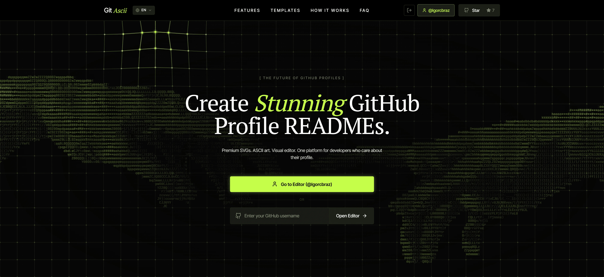
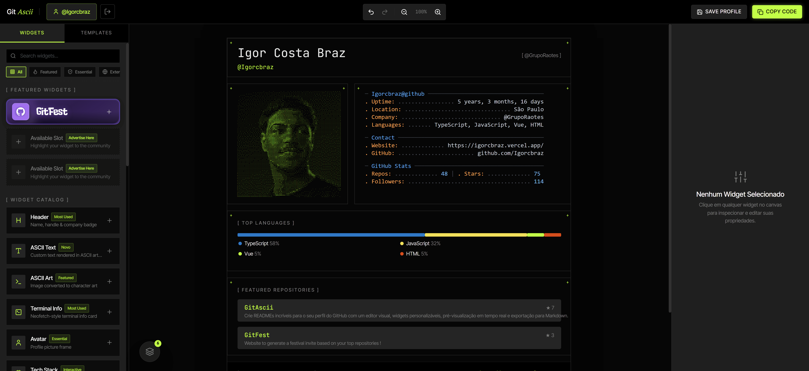

<div align="center">
  

  <h1>GitAscii</h1>

  <p>
    <b>Where cryptic terminals meet editorial newspaper design.</b><br />
    Elevate your GitHub presence to a premium design level dynamically and automatically.
  </p>

  <p>
    <a href="https://nextjs.org/"></a>
    <a href="https://react.dev/"></a>
    <a href="https://tailwindcss.com/"></a>
    <a href="https://www.typescriptlang.org/"></a>
  </p>

  <p>
    <a href="#-demo">Demo</a> •
    <a href="#-why-gitascii">Why GitAscii?</a> •
    <a href="#-features">Features</a> •
    <a href="#-how-it-works">How It Works</a> •
    <a href="#-architecture">Architecture</a> •
    <a href="#-project-structure">Project Structure</a>
  </p>
</div>

---

https://github.com/user-attachments/assets/1e262f59-e63b-438c-bc6e-9776dc796d8f

## 🔗 Demo

Experience the platform live. No installation required.

> **[🚀 Launch GitAscii in your Browser](https://gitascii.com/)**

---

## 💡 Why GitAscii?

Standard GitHub profiles are limited by standard Markdown. Maintaining an attractive, up-to-date README is tedious and requires constant manual updates.

**GitAscii** solves this by providing a complete visual platform where you can design your GitHub README using drag-and-drop widgets, ASCII art, and real-time statistics. Once designed, the engine generates a single, dynamic URL that you embed in your README. It auto-updates forever.

---

## ✨ Features

<div align="center">

| 🎨 **Visual Drag-and-Drop Editor**                                                                       | 🌗 **Adaptive Theme Rendering**                                                                  |
| :------------------------------------------------------------------------------------------------------- | :----------------------------------------------------------------------------------------------- |
| Build layouts intuitively without writing Markdown or code. Our editor feels like Figma for your README. | Automatically serves different SVGs matching the viewer's GitHub dark or light theme preference. |
| 📊 **Real-time GitHub Statistics**                                                                       | 🖼️ **ASCII Image Conversion Engine**                                                             |
| Seamlessly track commits, stars, top languages, and streaks without external manual setup.               | Turn any uploaded avatar or image into detailed ASCII character art in the browser.              |
| ⚡ **Dynamic Profile URLs**                                                                              | 🔄 **Zero-maintenance Updates**                                                                  |
| Embed a single static URL. Our engine generates the SVG on the fly every time it's requested.            | Say goodbye to manual cron jobs or GitHub Actions. Your layout stays fresh automatically.        |

</div>

## 🖼️ Preview

### Platform

<div align="center">
  
  <br/>
  <sup><i>GitAscii Landing Page and Dashboard</i></sup>
</div>

### Live Editor

<div align="center">
  
  <br/>
  <sup><i>The intuitive Drag-and-Drop Builder Interface</i></sup>
</div>

### Generated Output Example

This is what your GitHub profile could look like. Just drop the generated link in your README.

<div align="center">
  
  <br/>
  <sup><i>Dynamic SVG result rendered directly by GitHub</i></sup>
</div>

---

## ⚙️ How It Works

<details>
<summary><b>1. Create Your Layout</b></summary>
Use the drag-and-drop builder to compose your profile. Add terminal widgets, GitHub stats, ASCII art, and arrange them on the grid.
</details>

<details>
<summary><b>2. The Engine Processes Widgets</b></summary>
The client compiles your widget configuration into a state payload, gathering necessary metadata to render your components.
</details>

<details>
<summary><b>3. Dynamic SVG Generation</b></summary>
The Next.js backend aggregates component templates, fetches live GitHub API statistics, and constructs a highly optimized, raw SVG markup on the fly.
</details>

<details>
<summary><b>4. GitHub Renders the Result</b></summary>
You place the provided generated URL into your <code>README.md</code>. GitHub requests this dynamic image, displaying your fully updated layout on every page load.
</details>

---

## 🏗️ Architecture

GitAscii is highly modularized, separating client UI logic from server-side rendering:

| Layer                | Responsibility                                                                                                                  |
| -------------------- | ------------------------------------------------------------------------------------------------------------------------------- |
| **Editor Layer**     | The React/Zustand client-side visual interface where users interact, drag, drop, and configure widgets natively in the browser. |
| **Rendering Engine** | The core Next.js logic responsible for compiling widget layouts, applying styles, and assembling the final raw SVG output.      |
| **Data Layer**       | Connects to external services (GitHub API, WakaTime, etc.) to fetch and normalize user statistics securely on the backend.      |
| **Delivery Layer**   | Next.js Edge APIs serving the dynamic files, configured with proper caching headers optimized for GitHub's image proxy (camo).  |

---

## 🧠 Rendering Pipeline

GitAscii uses several interesting techniques to power the visual experience:

> **Adaptive Theme Rendering**  
> We leverage the HTML `<picture>` element and CSS media queries (`prefers-color-scheme`) to serve distinct SVGs depending on whether the user views GitHub in dark or light mode.

> **Image Processing Pipeline**  
> The ASCII image conversion relies on the HTML5 `Canvas API`. The engine draws images to a hidden canvas, uses `getImageData` to extract raw pixel arrays, and maps pixel luminance to custom character matrices.

> **Dynamic SVG Generation**  
> Instead of storing static files, our endpoint constructs structured SVG markup dynamically per request, injecting data and caching the result directly on Vercel Edge nodes.

---

## 📂 Project Structure

```text
GitAscii/
├── public/                 # Static assets, logos, and preview images
├── src/
│   ├── app/                # Next.js App Router (Pages, Layouts, API Routes)
│   ├── components/         # Shared UI components for the editor
│   ├── constants/          # Static data and configuration
│   ├── engine/             # Core logic for ASCII generation & dynamic SVG rendering
│   ├── features/           # Independent feature modules separated by domain
│   ├── lib/                # Shared utilities, hooks, and analytics helpers
│   └── middleware.ts       # Route protection and request middleware
├── design.md               # Detailed Design System specifications
├── analytics.md            # Event tracking documentation
├── theme.css               # Global CSS variables and design tokens
└── package.json            # Dependencies and build scripts
```

---

## 📝 Changelog

Check out our [CHANGELOG.md](CHANGELOG.md) to see what's new.

---

## 🤝 Contributing

We thank the following people who contributed to this project:

[](https://github.com/Igorcbraz/GitAscii/graphs/contributors)

Please read the [CONTRIBUTING.md](CONTRIBUTING.md) file before assuming anything about how to contribute, and please review our [Code of Conduct](CODE_OF_CONDUCT.md). Any contributions you make are **greatly appreciated**.

---

## 📄 License

Distributed under the MIT License. See `LICENSE` for more information.

<a href="https://www.star-history.com/?repos=Igorcbraz%2FGitAscii&type=timeline&legend=top-left">
 <picture>
   <source media="(prefers-color-scheme: dark)" srcset="https://api.star-history.com/chart?repos=Igorcbraz/GitAscii&type=timeline&theme=dark&legend=top-left&sealed_token=WAD4KArNuQ379AYAAoB6NexJVTlM87nPSibH24PjWHA2xpmSsSX4eJWBlGiU9tbd-YClRBG7XZHaW6SSUVIv27QhMZxnEnV0KgKySkMm5E6C6-iPLWte26fmitbhcT-QChuroLPJjncYMEl-nBkNYlSu4p4g9u5WHKRep13NneGZ7iZaiq0ZngEy0b53" />
   <source media="(prefers-color-scheme: light)" srcset="https://api.star-history.com/chart?repos=Igorcbraz/GitAscii&type=timeline&legend=top-left&sealed_token=WAD4KArNuQ379AYAAoB6NexJVTlM87nPSibH24PjWHA2xpmSsSX4eJWBlGiU9tbd-YClRBG7XZHaW6SSUVIv27QhMZxnEnV0KgKySkMm5E6C6-iPLWte26fmitbhcT-QChuroLPJjncYMEl-nBkNYlSu4p4g9u5WHKRep13NneGZ7iZaiq0ZngEy0b53" />
   
 </picture>
</a>

<div align="center">
  <sub>Built with design obsession by <a href="https://github.com/Igorcbraz">Igorcbraz</a>.</sub>
</div>
