<div align="center">
  <a href="https://gitascii.com">
    
  </a>

  <h1>GitAscii</h1>

  <p>
    <b>Where cryptic terminals meet editorial broadsheet design.</b><br />
    Transform your GitHub profile into a live, encrypted telemetry deck and high-contrast ASCII artwork.
  </p>

  <p>
    <a href="https://github.com/Igorcbraz/GitAscii/stargazers"></a>
    <a href="https://github.com/Igorcbraz/GitAscii/releases"></a>
    <a href="https://github.com/Igorcbraz/GitAscii/actions/workflows/ci.yml"></a>
    <a href="https://github.com/Igorcbraz/GitAscii/actions/workflows/codeql.yml"></a>
    <a href="LICENSE"></a>
  </p>

  <p>
    <a href="https://nextjs.org/"></a>
    <a href="https://react.dev/"></a>
    <a href="https://tailwindcss.com/"></a>
    <a href="https://www.typescriptlang.org/"></a>
    <a href="https://storybook.js.org/"></a>
    <a href="https://vercel.com/"></a>
  </p>

  <p>
    <a href="https://gitascii.com">Launch Web App</a> •
    <a href="#how-it-works">How It Works</a> •
    <a href="#quickstart">Quickstart</a> •
    <a href="#adding-new-community-templates">Creating Templates</a> •
    <a href="#developer-scripts">Developer Scripts</a> •
    <a href="#contributing">Contributing</a>
  </p>
</div>

---

<div align="center">
  <video src="https://github.com/Igorcbraz/GitAscii/raw/main/public/presentation.mp4" controls="controls" width="100%"></video>
</div>

> **No setup needed to start:** Design and preview your GitHub profile live in your browser at **[gitascii.com](https://gitascii.com/)**.

---

### 🎛️ Visual Drag-and-Drop Builder

Build your complete profile layout intuitively on a real-time reactive canvas. Move, resize, and configure telemetry decks, terminal metrics, and ASCII avatars directly in the browser.

<div align="center">
  
</div>

<br />

### 📰 The Landing Platform

A classified broadsheet aesthetic engineered with brutalist minimalism, monospaced data streams, and high-contrast signal lime accents.

<div align="center">
  
</div>

<br />

### ⚡ Live Generated SVG Output

What your GitHub profile actually renders: dynamic, high-density SVG output compiled on-the-fly at the edge with automatic dark/light theme switching.

<div align="center">
  
</div>

---

## How It Works

GitAscii uses a declarative layout file stored in your own GitHub profile repository. It connects your custom layout with edge-rendered dynamic data:

```mermaid
flowchart LR
    A["🎛️ GitAscii Web Editor<br/>(Design Layout)"] -->|"Download"| B["📄 gitascii.json<br/>(Config File)"]
    B -->|"Upload to Root"| C["🐙 GitHub Repo<br/>(username/username)"]
    C -->|"Live Query"| D["⚡ GitAscii Edge Server<br/>(Fetch Telemetry & Compile)"]
    D -->|"Dynamic SVG Stream"| E["🖼️ Profile README.md<br/>(Rendered in Browser)"]

    style A fill:#1f1f1f,stroke:#c5ff4a,stroke-width:1px,color:#ffffff
    style B fill:#060606,stroke:#252525,stroke-width:1px,color:#c5ff4a
    style C fill:#1f1f1f,stroke:#252525,stroke-width:1px,color:#ffffff
    style D fill:#1f1f1f,stroke:#c5ff4a,stroke-width:2px,color:#ffffff
    style E fill:#060606,stroke:#c5ff4a,stroke-width:1px,color:#c5ff4a
```



### 1. Design & Download Configuration

Compose your layout in the [Visual Editor](https://gitascii.com). When done, click **Export** to download your profile configuration file:

- Default profile: `gitascii.json`
- Custom profile slug: `gitascii_[profile_slug].json`

> **Note:** Keep the exact filename. GitAscii strictly queries for this name in the root of your special repository.

### 2. Upload to your GitHub Profile Repository

Upload `gitascii.json` to the **root** of your special GitHub repository (`username/username`).

### 3. Embed into your Profile `README.md`

Paste the generated snippet into your `README.md`. It automatically adapts to the viewer's GitHub Dark or Light theme:

```html

```

> **Tip (Cache Invalidation):** GitHub caches external images through its Camo proxy. Whenever you update your `gitascii.json`, update the version parameter in your README links (e.g. using a current Unix timestamp like `?v=1740672000` or simply incrementing `?v=2`) to force GitHub to fetch and render the new layout instantly.

---

## Adding New Community Templates

Want to share a custom layout with the community? Adding a new template takes two simple steps:

1. **Export the Template JSON in the Editor:**  
   Click the export template action in the sidebar. GitAscii automatically scrubs personal data (usernames, custom bio, avatars) while preserving the grid layout, widgets, and visual tokens.
2. **Drop your JSON file into `src/data/templates/`:**  
   Place your file as `src/data/templates/<template_name>.json` and register it in `src/data/templates/index.ts`. Open a Pull Request and your template will be available to all GitAscii users!

---

## Quickstart

Run your own instance of GitAscii locally:

```bash
# 1. Clone the repository
git clone https://github.com/Igorcbraz/GitAscii.git

# 2. Navigate to the project directory
cd GitAscii

# 3. Install dependencies
npm install

# 4. Start the development server
npm run dev
```

Open [http://localhost:3000](http://localhost:3000) in your browser.

---

## Developer Scripts

All available scripts configured in `package.json`:

| Command                   | Description                                                                         |
| :------------------------ | :---------------------------------------------------------------------------------- |
| `npm run dev`             | Starts the Next.js local development server on port `3000`                          |
| `npm run build`           | Compiles the production build and verifies type definitions                         |
| `npm run start`           | Boots the compiled Next.js production server                                        |
| `npm run check`           | Comprehensive pipeline check: executes `typecheck`, `lint`, and `build` in sequence |
| `npm run typecheck`       | Validates all TypeScript types across the codebase (`tsc --noEmit`)                 |
| `npm run lint`            | Analyzes code for issues and stylistic discrepancies using ESLint                   |
| `npm run lint:fix`        | Automatically fixes auto-fixable ESLint warnings and errors                         |
| `npm run format`          | Formats the entire codebase using Prettier                                          |
| `npm run format:check`    | Verifies whether all files conform to Prettier formatting rules                     |
| `npm run fix:all`         | Executes both `lint:fix` and `format` together for complete code cleanup            |
| `npm run test`            | Runs the full unit and integration test suite via **Vitest**                        |
| `npm run test:e2e`        | Runs automated end-to-end browser tests via **Playwright**                          |
| `npm run test:e2e:ui`     | Opens the **Playwright** interactive UI mode for visual debugging                   |
| `npm run storybook`       | Launches the isolated UI widget and component workbench on port `6006`              |
| `npm run build-storybook` | Compiles the Storybook workbench into a static production bundle                    |
| `npm run email:dev`       | Launches the React Email local preview server on port `3001`                        |
| `npm run docs`            | Launches the interactive documentation server locally via **Mintlify**              |
| `npm run prepare`         | Configures Git hooks (pre-commit, commit-msg) via **Husky**                         |

---

## Contributing

Contributions make the open-source community thrive. Follow this step-by-step workflow to contribute:

```bash
# 1. Fork the repository on GitHub, then clone your fork
git clone https://github.com/<your-username>/GitAscii.git
cd GitAscii

# 2. Install dependencies (initializes Husky hooks)
npm install

# 3. Create a descriptive feature/fix branch
git checkout -b feat/my-awesome-feature

# 4. Make your changes and verify code quality
npm run check
npm run test

# 5. Commit using Conventional Commits format (enforced by Commitlint)
git commit -m "feat(editor): add new ASCII matrix filter widget"

# 6. Push to your branch and open a Pull Request
git push origin feat/my-awesome-feature
```

Please review our [CONTRIBUTING.md](CONTRIBUTING.md) and [CODE_OF_CONDUCT.md](CODE_OF_CONDUCT.md) before submitting a pull request.

<div align="center">
 
</div>

## 📈 Star History

<div align="center">
  <a href="https://www.star-history.com/?repos=Igorcbraz%2FGitAscii&type=timeline&legend=top-left">
    <picture>
      <source media="(prefers-color-scheme: dark)" srcset="https://api.star-history.com/chart?repos=Igorcbraz/GitAscii&type=timeline&theme=dark&legend=top-left&sealed_token=WAD4KArNuQ379AYAAoB6NexJVTlM87nPSibH24PjWHA2xpmSsSX4eJWBlGiU9tbd-YClRBG7XZHaW6SSUVIv27QhMZxnEnV0KgKySkMm5E6C6-iPLWte26fmitbhcT-QChuroLPJjncYMEl-nBkNYlSu4p4g9u5WHKRep13NneGZ7iZaiq0ZngEy0b53" />
      <source media="(prefers-color-scheme: light)" srcset="https://api.star-history.com/chart?repos=Igorcbraz/GitAscii&type=timeline&legend=top-left&sealed_token=WAD4KArNuQ379AYAAoB6NexJVTlM87nPSibH24PjWHA2xpmSsSX4eJWBlGiU9tbd-YClRBG7XZHaW6SSUVIv27QhMZxnEnV0KgKySkMm5E6C6-iPLWte26fmitbhcT-QChuroLPJjncYMEl-nBkNYlSu4p4g9u5WHKRep13NneGZ7iZaiq0ZngEy0b53" />
      
    </picture>
  </a>
</div>

## 📄 License

Distributed under the **MIT License**. See [`LICENSE`](LICENSE) for more information.

<div align="center">
  <sub>Engineered with design obsession by <a href="https://github.com/Igorcbraz"><b>@Igorcbraz</b></a>.</sub>
</div>
