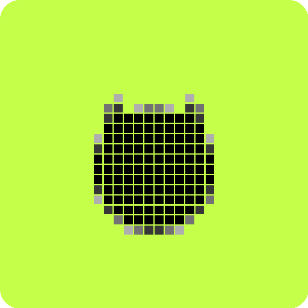

<div align="center">
  

  # ── GitAscii ──
  
  > **O terminal criptográfico encontra o editorial de jornal** — a sua presença no GitHub elevada ao nível de design premium de forma dinâmica e automatizada.

  [](https://nextjs.org/)
  [](https://react.dev/)
  [](https://tailwindcss.com/)
  [](https://www.typescriptlang.org/)
  
</div>

---

### `[ STATUS: CLASSIFIED // SYSTEM OVERVIEW ]`

**GitAscii** é uma plataforma que transforma perfis e históricos de commits do GitHub em arte ASCII de alto impacto e badges dinâmicos, envelopados em um design editorial sofisticado. 

Diferente de geradores genéricos de README, o GitAscii combina o estilo técnico de *command-line interfaces* com a sofisticação de tipografias clássicas de jornais de grande circulação — utilizando fundos escuros profundos (`Void Black`) pontuados por um verde neon enérgico (`Signal Lime` / `#c5ff4a`) para destacar informações cruciais.

---

## ⚡ Recursos Principais

```
┌────────────────────────────────────────────────────────────────────────┐
│  FEATURE                │ DESCRIPTION                                  │
├─────────────────────────┼──────────────────────────────────────────────┤
│ 🎨 Editor Visual        │ Interface de arrastar e soltar inspirada no  │
│                         │ Figma/Canva com renderização instantânea.    │
├─────────────────────────┼──────────────────────────────────────────────┤
│ 📟 Motor ASCII          │ Converta imagens e fotos em arte ASCII com   │
│                         │ mais de 6 conjuntos de caracteres e controle.│
├─────────────────────────┼──────────────────────────────────────────────┤
│ 📐 Templates Premium    │ +13 layouts prontos, do estilo Terminal      │
│                         │ Minimalista ao Cyberpunk Industrial.         │
├─────────────────────────┼──────────────────────────────────────────────┤
│ 🔗 Renderização Direta  │ Seus SVGs são servidos via URL dinâmica,     │
│                         │ mantendo-se sempre atualizados no GitHub.    │
├─────────────────────────┼──────────────────────────────────────────────┤
│ 🤖 Geração Inteligente  │ Analise o perfil do usuário e crie o layout  │
│                         │ perfeito em poucos segundos automaticamente. │
└────────────────────────────────────────────────────────────────────────┘
```

---

## 🎨 Paleta de Cores & Design System

A identidade visual do GitAscii segue regras rígidas documentadas no nosso [Design Guide](file:///C:/Repos/GitAscii/design.md):

*   **`Void Black` (`#000000`)** — O pano de fundo absoluto de toda a aplicação.
*   **`Carbon` (`#060606`)** — A cor de canvas dominante para evitar fadiga visual.
*   **`Graphite` (`#252525`)** — O tom mid-neutral para painéis elevados, navbars e cartões.
*   **`Signal Lime` (`#c5ff4a`)** — A única cor cromática. Usada estritamente para call-to-actions, bordas ativas e ênfase de palavras-chave.
*   **`Chalk` (`#ffffff`) & `Bone` (`#e5e5e5`)** — Textos de alta ênfase e legibilidade sem vibração visual.

---

## 🛠️ Tecnologias Utilizadas

O ecossistema do GitAscii é construído com tecnologia moderna e otimizada para performance:

-   **Framework:** [Next.js 15.3](https://nextjs.org/) (App Router)
-   **Biblioteca Principal:** [React 19](https://react.dev/)
-   **Estilização:** [Tailwind CSS 4.0](https://tailwindcss.com/) & PostCSS
-   **Animações:** [Motion (Framer Motion 12)](https://motion.dev/)
-   **Gerenciamento de Estado:** [Zustand](https://github.com/pmndrs/zustand)
-   **Linguagem:** [TypeScript](https://www.typescriptlang.org/)

---

## 🚀 Como Iniciar Localmente

Siga o passo a passo para rodar o projeto em ambiente de desenvolvimento:

### 1. Clonar o repositório
```bash
git clone https://github.com/Igorcbraz/GitAscii.git
cd GitAscii
```

### 2. Instalar as dependências
```bash
npm install
```

### 3. Executar o servidor de desenvolvimento
```bash
npm run dev
```

Abra [http://localhost:3000](http://localhost:3000) no seu navegador para ver o resultado.

---

## 📂 Estrutura de Diretórios

```
GitAscii/
├── public/                 # Assets públicos estáticos (Ícones, Ilustrações)
│   └── icon-512.png        # Logotipo principal oficial
├── src/
│   ├── app/                # Rotas, layouts e páginas da aplicação Next.js
│   ├── components/         # Componentes UI de uso compartilhado
│   ├── constants/          # Constantes estáticas e dados estáticos
│   ├── engine/             # Motores de conversão ASCII e renderizadores
│   ├── features/           # Funcionalidades modulares (editor, landing page, github api)
│   ├── lib/                # Configurações auxiliares e utilitários
│   └── middleware.ts       # Middlewares de rota e segurança
├── design.md               # Especificação técnica do Design System
├── theme.css               # Definições das variáveis CSS customizadas
└── package.json            # Dependências e scripts do projeto
```

---

<div align="center">
  <sub>Construído com obsessão por design por <a href="https://github.com/Igorcbraz">Igorcbraz</a>.</sub>
</div>
