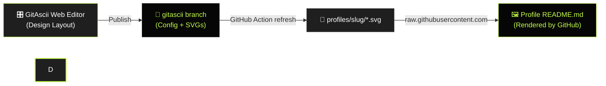

<div align="center">
  <a href="https://gitascii.com">
    
  </a>

  <h1>GitAscii</h1>

  <p>
    <b>Where cryptic terminals meet editorial broadsheet design.</b><br />
    Transform your GitHub profile into a live, encrypted telemetry deck and high-contrast ASCII artwork.
  </p>

  <p>
    <a href="https://github.com/Igorcbraz/GitAscii/stargazers"></a>
    <a href="https://github.com/Igorcbraz/GitAscii/releases"></a>
    <a href="https://github.com/Igorcbraz/GitAscii/actions/workflows/ci.yml"></a>
    <a href="https://github.com/Igorcbraz/GitAscii/actions/workflows/codeql.yml"></a>
    <a href="LICENSE"></a>
  </p>

  <p>
    <a href="https://nextjs.org/"></a>
    <a href="https://react.dev/"></a>
    <a href="https://tailwindcss.com/"></a>
    <a href="https://www.typescriptlang.org/"></a>
    <a href="https://storybook.js.org/"></a>
    <a href="https://www.cloudflare.com/developer-platform/products/workers/"></a>
  </p>

  <p>
    <a href="https://gitascii.com">Launch Web App</a> •
    <a href="#how-it-works">How It Works</a> •
    <a href="#quickstart">Quickstart</a> •
    <a href="#adding-new-community-templates">Creating Templates</a> •
    <a href="#developer-scripts">Developer Scripts</a> •
    <a href="#contributing">Contributing</a>
  </p>
</div>

---

<div align="center">
  <video src="https://github.com/Igorcbraz/GitAscii/raw/main/public/presentation.mp4" controls="controls" width="100%"></video>
</div>

> **No setup needed to start:** Design and preview your GitHub profile live in your browser at **[gitascii.com](https://gitascii.com/)**.

---

### 🎛️ Visual Drag-and-Drop Builder

Build your complete profile layout intuitively on a real-time reactive canvas. Move, resize, and configure telemetry decks, terminal metrics, and ASCII avatars directly in the browser.

<div align="center">
  
</div>

<br />

### 📰 The Landing Platform

A classified broadsheet aesthetic engineered with brutalist minimalism, monospaced data streams, and high-contrast signal lime accents.

<div align="center">
  
</div>

<br />

### ⚡ Live Generated SVG Output

What your GitHub profile actually renders: dynamic, high-density SVG output compiled on-the-fly at the edge with automatic dark/light theme switching.

<div align="center">
  
</div>

---

## How It Works

GitAscii v2 publishes self-contained SVG files from a dedicated `gitascii` branch in your own GitHub profile repository. GitHub Actions refreshes the files without putting the rendering service in the README request path:



### 1. Design & Publish

Compose your layout in the [Visual Editor](https://gitascii.com). When done, use **Publish to GitHub**. GitAscii creates or updates:

- the dedicated `gitascii` branch;
- `gitascii.json` for the default profile and `gitascii_[slug].json` for additional profiles;
- dark and light SVG files under `profiles/[slug]/`;
- `.github/workflows/gitascii.yml` on the default branch.

The GitHub Action publishes every configured profile atomically. Pro installations also enable authenticated, profile-scoped publication health telemetry and add a small analytics badge to the README.

### 2. Authorize the GitHub App

Authorize GitAscii for your special profile repository (`username/username`). The editor performs the branch, workflow, and README updates for you.

### 3. Embed into your Profile `README.md`

Paste the generated snippet into your `README.md`. It automatically adapts to the viewer's GitHub Dark or Light theme:

```html

```

The generated `<picture>` snippet contains both light and dark raw GitHub URLs. Updates keep the same stable URL and are performed by the repository workflow.

For Pro profiles, keep the generated GitAscii badge directly below the `<picture>`. Because v2 SVGs are served by GitHub rather than GitAscii, this badge is the only privacy-safe analytics signal. Its numbers represent badge fetches observed by GitAscii (usually GitHub Camo cache refreshes), **not exact human views or unique visitors**. GitHub's image proxy does not expose reliable viewer geography, browser, device, or identity, so the dashboard intentionally does not invent those fields.

---

## Adding New Community Templates

Want to share a custom layout with the community? Adding a new template takes two simple steps:

1. **Export the Template JSON in the Editor:**  
   Click the export template action in the sidebar. GitAscii automatically scrubs personal data (usernames, custom bio, avatars) while preserving the grid layout, widgets, and visual tokens.
2. **Drop your JSON file into `src/data/templates/`:**  
   Place your file as `src/data/templates/<template_name>.json` and register it in `src/data/templates/index.ts`. Open a Pull Request and your template will be available to all GitAscii users!

---

## Quickstart

Run your own instance of GitAscii locally:

```bash
# 1. Clone the repository
git clone https://github.com/Igorcbraz/GitAscii.git

# 2. Navigate to the project directory
cd GitAscii

# 3. Install dependencies
npm install

# 4. Start the development server
npm run dev
```

Open [http://localhost:3000](http://localhost:3000) in your browser.

---

## Developer Scripts

All available scripts configured in `package.json`:

| Command                   | Description                                                                         |
| :------------------------ | :---------------------------------------------------------------------------------- |
| `npm run dev`             | Starts the Next.js local development server on port `3000`                          |
| `npm run build`           | Compiles the production build and verifies type definitions                         |
| `npm run start`           | Boots the compiled Next.js production server                                        |
| `npm run check`           | Comprehensive pipeline check: executes `typecheck`, `lint`, and `build` in sequence |
| `npm run typecheck`       | Validates all TypeScript types across the codebase (`tsc --noEmit`)                 |
| `npm run lint`            | Analyzes code for issues and stylistic discrepancies using ESLint                   |
| `npm run lint:fix`        | Automatically fixes auto-fixable ESLint warnings and errors                         |
| `npm run format`          | Formats the entire codebase using Prettier                                          |
| `npm run format:check`    | Verifies whether all files conform to Prettier formatting rules                     |
| `npm run fix:all`         | Executes both `lint:fix` and `format` together for complete code cleanup            |
| `npm run test`            | Runs the full unit and integration test suite via **Vitest**                        |
| `npm run test:e2e`        | Runs automated end-to-end browser tests via **Playwright**                          |
| `npm run test:e2e:ui`     | Opens the **Playwright** interactive UI mode for visual debugging                   |
| `npm run storybook`       | Launches the isolated UI widget and component workbench on port `6006`              |
| `npm run build-storybook` | Compiles the Storybook workbench into a static production bundle                    |
| `npm run email:dev`       | Launches the React Email local preview server on port `3001`                        |
| `npm run docs`            | Launches the interactive documentation server locally via **Mintlify**              |
| `npm run prepare`         | Configures Git hooks (pre-commit, commit-msg) via **Husky**                         |

---

## Contributing

Contributions make the open-source community thrive. Follow this step-by-step workflow to contribute:

```bash
# 1. Fork the repository on GitHub, then clone your fork
git clone https://github.com/<your-username>/GitAscii.git
cd GitAscii

# 2. Install dependencies (initializes Husky hooks)
npm install

# 3. Create a descriptive feature/fix branch
git checkout -b feat/my-awesome-feature

# 4. Make your changes and verify code quality
npm run check
npm run test

# 5. Commit using Conventional Commits format (enforced by Commitlint)
git commit -m "feat(editor): add new ASCII matrix filter widget"

# 6. Push to your branch and open a Pull Request
git push origin feat/my-awesome-feature
```

Please review our [CONTRIBUTING.md](CONTRIBUTING.md) and [CODE_OF_CONDUCT.md](CODE_OF_CONDUCT.md) before submitting a pull request.

<div align="center">
 
</div>

## 📈 Star History

<div align="center">
  <a href="https://www.star-history.com/?repos=Igorcbraz%2FGitAscii&type=timeline&legend=top-left">
    <picture>
      <source media="(prefers-color-scheme: dark)" srcset="https://api.star-history.com/chart?repos=Igorcbraz/GitAscii&type=timeline&theme=dark&legend=top-left&sealed_token=WAD4KArNuQ379AYAAoB6NexJVTlM87nPSibH24PjWHA2xpmSsSX4eJWBlGiU9tbd-YClRBG7XZHaW6SSUVIv27QhMZxnEnV0KgKySkMm5E6C6-iPLWte26fmitbhcT-QChuroLPJjncYMEl-nBkNYlSu4p4g9u5WHKRep13NneGZ7iZaiq0ZngEy0b53" />
      <source media="(prefers-color-scheme: light)" srcset="https://api.star-history.com/chart?repos=Igorcbraz/GitAscii&type=timeline&legend=top-left&sealed_token=WAD4KArNuQ379AYAAoB6NexJVTlM87nPSibH24PjWHA2xpmSsSX4eJWBlGiU9tbd-YClRBG7XZHaW6SSUVIv27QhMZxnEnV0KgKySkMm5E6C6-iPLWte26fmitbhcT-QChuroLPJjncYMEl-nBkNYlSu4p4g9u5WHKRep13NneGZ7iZaiq0ZngEy0b53" />
      
    </picture>
  </a>
</div>

## 📄 License

Distributed under the **GNU General Public License v3.0 (GPLv3)**. See [`LICENSE`](LICENSE) for more information.

<div align="center">
  <sub>Engineered with design obsession by <a href="https://github.com/Igorcbraz"><b>@Igorcbraz</b></a>.</sub>
</div>


## 🌐 Web Resources & Aesthetic Symbols Index
- [SYM 26D5](https://mecha-crosshair-symbols-40.pages.dev/symbol/sym-26d5/)
- [SYM 1D44B](https://zen-unicode-hub-94.pages.dev/symbol/sym-1d44b/)
- [SYM 1D46E](https://kawaii-kaomoji-hub-51.pages.dev/symbol/sym-1d46e/)
- [SYM 263A FE0F](https://baroque-unicode-decor-43.pages.dev/symbol/sym-263a-fe0f/)
- [BRACKETS](https://sleek-bio-symbols-40.pages.dev/vi/brackets/)
- [SYM 1F92D](https://sleek-bio-symbols-40.pages.dev/symbol/sym-1f92d/)
- [AESTHETIC MINIMAL CLOUD](https://scholar-rune-symbols-77.pages.dev/symbol/aesthetic-minimal-cloud/)
- [LEFT MATHEMATICAL WHITE SQUARE BRACKET](https://ribbon-heart-fonts-86.pages.dev/symbol/left-mathematical-white-square-bracket/)
- [SYM 2642](https://neon-futuristic-symbols-62.pages.dev/symbol/sym-2642/)
- [SYM 1D43A](https://synth-dystopia-text-20.pages.dev/symbol/sym-1d43a/)
- [SYM 1F912](https://soft-bow-fonts-22.pages.dev/symbol/sym-1f912/)
- [CURLY RIBBON LOOP](https://minimal-star-symbols-54.pages.dev/symbol/curly-ribbon-loop/)
- [SYM 2642](https://occult-aesthetic-symbols-26.pages.dev/symbol/sym-2642/)
- [ZODIAC CELESTIAL](https://minimal-star-symbols-54.pages.dev/ja/zodiac-celestial/)
- [SYM 26A3](https://futuristic-gaming-fonts-52.pages.dev/symbol/sym-26a3/)
- [TIKTOK CAPTIONS](https://sleek-bio-symbols-51.pages.dev/es/tiktok-captions/)
- [SYM 1FAE4](https://occult-aesthetic-symbols-26.pages.dev/symbol/sym-1fae4/)
- [ARROWS LINES](https://vintage-scholar-text-15.pages.dev/arrows-lines/)
- [SYM 26FE](https://monochrome-text-lab-86.pages.dev/symbol/sym-26fe/)
- [SYM 1D46F](https://minimal-star-symbols-43.pages.dev/symbol/sym-1d46f/)
- [SYM 1D402](https://anime-sparkle-text-73.pages.dev/symbol/sym-1d402/)
- [SYM 26DF](https://neon-futuristic-symbols-62.pages.dev/symbol/sym-26df/)
- [SAGITTARIUS ZODIAC ARCHER](https://vintage-runes-text-63.pages.dev/symbol/sagittarius-zodiac-archer/)
- [SYM 26FF](https://gothic-bio-fonts-98.pages.dev/symbol/sym-26ff/)
- [SYM 1F606](https://soft-angel-unicode-43.pages.dev/symbol/sym-1f606/)
- [MUSIC WEATHER](https://vintage-scholar-text-15.pages.dev/pt/music-weather/)
- [SYM 1D40E](https://gothic-bio-fonts-86.pages.dev/symbol/sym-1d40e/)
- [SYM 1D40A](https://vintage-script-symbols-65.pages.dev/symbol/sym-1d40a/)
- [SYM 1F49E](https://synthwave-text-art-35.pages.dev/symbol/sym-1f49e/)
- [SYM 2744](https://angelic-ribbon-text-78.pages.dev/symbol/sym-2744/)
- [SYM 1D463](https://gothic-bio-fonts-81.pages.dev/symbol/sym-1d463/)
- [SYM 1D44B](https://matrix-glitch-text-37.pages.dev/symbol/sym-1d44b/)
- [SYM 1D466](https://pastel-manga-symbols-57.pages.dev/symbol/sym-1d466/)
- [SYM 2626](https://scholarly-script-hub-43.pages.dev/symbol/sym-2626/)
- [SYM 26FB](https://mecha-synth-kaomoji-92.pages.dev/symbol/sym-26fb/)
- [SYM 1D488](https://synthwave-text-art-35.pages.dev/symbol/sym-1d488/)
- [SYM 26AC](https://futuristic-gaming-fonts-52.pages.dev/symbol/sym-26ac/)
- [SYM 26D1](https://neon-futuristic-symbols-62.pages.dev/symbol/sym-26d1/)
- [BEAMED SIXTEENTH MUSICAL NOTES](https://modern-bullet-symbols-45.pages.dev/symbol/beamed-sixteenth-musical-notes/)
- [STAR OPERATOR](https://arcane-symbol-vault-32.pages.dev/symbol/star-operator/)
- [SYM 1D491](https://zen-spacing-text-68.pages.dev/symbol/sym-1d491/)
- [SYM 1D41B](https://matrix-glitch-text-37.pages.dev/symbol/sym-1d41b/)
- [SYM 1D429](https://coquette-aesthetic-symbols-63.pages.dev/symbol/sym-1d429/)
- [SYM 2628](https://mecha-synth-kaomoji-92.pages.dev/symbol/sym-2628/)
- [SYM 26BF](https://scholar-rune-symbols-77.pages.dev/symbol/sym-26bf/)
- [SYM 1F61B](https://chibi-bunny-symbols-82.pages.dev/symbol/sym-1f61b/)
- [RIGHT MATHEMATICAL WHITE SQUARE BRACKET](https://daintystar-font-studio-48.pages.dev/symbol/right-mathematical-white-square-bracket/)
- [SYM 26CC](https://neon-futuristic-symbols-62.pages.dev/symbol/sym-26cc/)
- [SYM 2620 FE0F](https://minimal-star-symbols-54.pages.dev/symbol/sym-2620-fe0f/)
- [SYM 1D488](https://clean-aesthetic-fonts-33.pages.dev/symbol/sym-1d488/)
- [SYM 268F](https://minimal-star-symbols-54.pages.dev/symbol/sym-268f/)
- [SYM 26BA](https://gothic-bio-fonts-98.pages.dev/symbol/sym-26ba/)
- [SYM 1D400](https://zen-aesthetic-fonts-87.pages.dev/symbol/sym-1d400/)
- [SYM 1FAE2](https://monochrome-text-lab-86.pages.dev/symbol/sym-1fae2/)
- [CRYING TEARS SAD KAOMOJI](https://occult-aesthetic-symbols-26.pages.dev/symbol/crying-tears-sad-kaomoji/)
- [TRENDING](https://techno-hacker-text-43.pages.dev/pt/trending/)
- [SYM 1F480](https://synthwave-text-art-35.pages.dev/symbol/sym-1f480/)
- [SYM 26DA](https://sleek-dot-symbols-31.pages.dev/symbol/sym-26da/)
- [SYM 1F63D](https://minimal-star-symbols-25.pages.dev/symbol/sym-1f63d/)
- [SYM 263F](https://scholarly-script-hub-43.pages.dev/symbol/sym-263f/)
- [MUSIC WEATHER](https://scholarly-script-hub-43.pages.dev/vi/music-weather/)
- [SYM 26C4](https://neon-hacker-text-25.pages.dev/symbol/sym-26c4/)
- [SYM 1D487](https://minimal-star-symbols-43.pages.dev/symbol/sym-1d487/)
- [WATER BUBBLES](https://zen-unicode-hub-94.pages.dev/symbol/water-bubbles/)
- [STARS](https://scholar-rune-symbols-77.pages.dev/vi/stars/)
- [SYM 1D43A](https://gothic-bio-fonts-98.pages.dev/symbol/sym-1d43a/)
- [SYM 2680](https://neon-futuristic-symbols-62.pages.dev/symbol/sym-2680/)
- [SYM 1D46C](https://anime-sparkle-text-81.pages.dev/symbol/sym-1d46c/)
- [SYM 26C1](https://gothic-bio-fonts-98.pages.dev/symbol/sym-26c1/)
- [SYM 2638](https://neon-futuristic-symbols-62.pages.dev/symbol/sym-2638/)
- [SYM 1FA77](https://cyber-clan-tags-36.pages.dev/symbol/sym-1fa77/)
- [SYM 2724](https://neon-futuristic-symbols-62.pages.dev/symbol/sym-2724/)
- [SYM 26FD](https://matrix-glitch-text-37.pages.dev/symbol/sym-26fd/)
- [SYM 26BB](https://cyber-clan-tags-69.pages.dev/symbol/sym-26bb/)
- [SYM 1F614](https://gothic-bio-fonts-81.pages.dev/symbol/sym-1f614/)
- [BORDERS DIVIDERS](https://minimal-star-symbols-91.pages.dev/ja/borders-dividers/)
- [SYM 1FAE1](https://futuristic-gaming-fonts-52.pages.dev/symbol/sym-1fae1/)
- [SYM 1F633](https://monochrome-text-lab-86.pages.dev/symbol/sym-1f633/)
- [SYM 1D448](https://moe-soft-emoticons-41.pages.dev/symbol/sym-1d448/)
- [SYM 265F](https://cyber-clan-tags-36.pages.dev/symbol/sym-265f/)
- [SYM 268C](https://gothic-bio-fonts-86.pages.dev/symbol/sym-268c/)
- [SYM 1D416](https://minimal-star-symbols-54.pages.dev/symbol/sym-1d416/)
- [SYM 273D](https://monochrome-text-lab-86.pages.dev/symbol/sym-273d/)
- [SYM 260C](https://minimal-star-symbols-25.pages.dev/symbol/sym-260c/)
- [LAST QUARTER CRESCENT MOON](https://gothic-bio-fonts-86.pages.dev/symbol/last-quarter-crescent-moon/)
- [LEFT WHITE CORNER BRACKET](https://minimal-star-symbols-25.pages.dev/symbol/left-white-corner-bracket/)
- [SYM 1D475](https://clean-line-emojis-93.pages.dev/symbol/sym-1d475/)
- [SYM 1F612](https://kawaii-kaomoji-hub-77.pages.dev/symbol/sym-1f612/)
- [FLORAL BRANCH BOUQUET](https://mecha-synth-kaomoji-92.pages.dev/symbol/floral-branch-bouquet/)
- [RIGHT HEAVY BRACKET BOX](https://gothic-bio-fonts-86.pages.dev/symbol/right-heavy-bracket-box/)
- [LATIN CROSS FAITH](https://techno-hacker-text-43.pages.dev/symbol/latin-cross-faith/)
- [ROBLOX NAMES](https://anime-sparkle-text-14.pages.dev/pt/roblox-names/)
- [SYM 1D461](https://matrix-glitch-text-37.pages.dev/symbol/sym-1d461/)
- [SYM 2645](https://futuristic-gaming-fonts-52.pages.dev/symbol/sym-2645/)
- [SYM 2732](https://mecha-synth-kaomoji-92.pages.dev/symbol/sym-2732/)
- [FLORAL HEART VINE](https://clean-aesthetic-fonts-73.pages.dev/symbol/floral-heart-vine/)
- [SYM 1D476](https://matrix-glitch-text-37.pages.dev/symbol/sym-1d476/)
- [SYM 1D4A5](https://synthwave-text-art-35.pages.dev/symbol/sym-1d4a5/)
- [SYM 1D409](https://vintage-angel-text-38.pages.dev/symbol/sym-1d409/)
- [SPRING TULIP BLOSSOM](https://coquette-aesthetic-symbols-63.pages.dev/symbol/spring-tulip-blossom/)
- [SYM 2634](https://scholarly-script-hub-43.pages.dev/symbol/sym-2634/)
- [SYM 1D46D](https://moe-soft-emoticons-41.pages.dev/symbol/sym-1d46d/)
- [SYM 1D445](https://gothic-bio-fonts-98.pages.dev/symbol/sym-1d445/)
- [SYM 1D431](https://clean-line-emojis-93.pages.dev/symbol/sym-1d431/)
- [BORDERS DIVIDERS](https://dolly-angel-fonts-14.pages.dev/vi/borders-dividers/)
- [SYM 267A](https://minimal-star-symbols-25.pages.dev/symbol/sym-267a/)
- [NATURE FLOWERS](https://daintystar-font-studio-48.pages.dev/pt/nature-flowers/)
- [SYM 2640](https://minimal-star-symbols-43.pages.dev/symbol/sym-2640/)
- [SYM 1F602](https://mecha-synth-kaomoji-92.pages.dev/symbol/sym-1f602/)
- [SYM 2641](https://vintage-angel-text-38.pages.dev/symbol/sym-2641/)
- [DISCORD STATUS](https://futuristic-gaming-fonts-52.pages.dev/ru/discord-status/)
- [SYM 26D8](https://gothic-bio-fonts-98.pages.dev/symbol/sym-26d8/)
- [SYM 1F635 200D 1F4AB](https://clean-aesthetic-fonts-73.pages.dev/symbol/sym-1f635-200d-1f4ab/)
- [SWIMMING FISH RIGHT](https://clean-aesthetic-fonts-73.pages.dev/symbol/swimming-fish-right/)
- [SYM 268E](https://dolly-angel-fonts-14.pages.dev/symbol/sym-268e/)
- [SYM 265A](https://arcane-symbol-vault-32.pages.dev/symbol/sym-265a/)
- [SYM 26BB](https://sleek-dot-symbols-31.pages.dev/symbol/sym-26bb/)
- [CUPID FEATHERY ARROW](https://zen-aesthetic-fonts-87.pages.dev/symbol/cupid-feathery-arrow/)
- [STARRY ELEVATION AURA](https://synthwave-text-art-35.pages.dev/symbol/starry-elevation-aura/)
- [SYM 1D42A](https://clean-line-emojis-93.pages.dev/symbol/sym-1d42a/)
- [SYM 1F971](https://mecha-synth-kaomoji-92.pages.dev/symbol/sym-1f971/)
- [SYM 26DF](https://gothic-bio-fonts-86.pages.dev/symbol/sym-26df/)
- [SYM 2627](https://mecha-synth-kaomoji-92.pages.dev/symbol/sym-2627/)
- [CANCER ZODIAC CRAB](https://neon-futuristic-symbols-62.pages.dev/symbol/cancer-zodiac-crab/)
- [ROBLOX NAMES](https://futuristic-gaming-fonts-52.pages.dev/ru/roblox-names/)
- [SYM 1F910](https://dark-poetry-fonts-30.pages.dev/symbol/sym-1f910/)
- [SYM 1D44D](https://matrix-glitch-text-37.pages.dev/symbol/sym-1d44d/)
- [SYM 1F634](https://moe-soft-emoticons-41.pages.dev/symbol/sym-1f634/)
- [SYM 1F630](https://sleek-bio-symbols-40.pages.dev/symbol/sym-1f630/)
- [SYM 1F970](https://synthwave-text-art-35.pages.dev/symbol/sym-1f970/)
