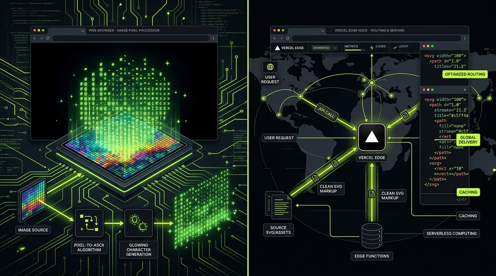
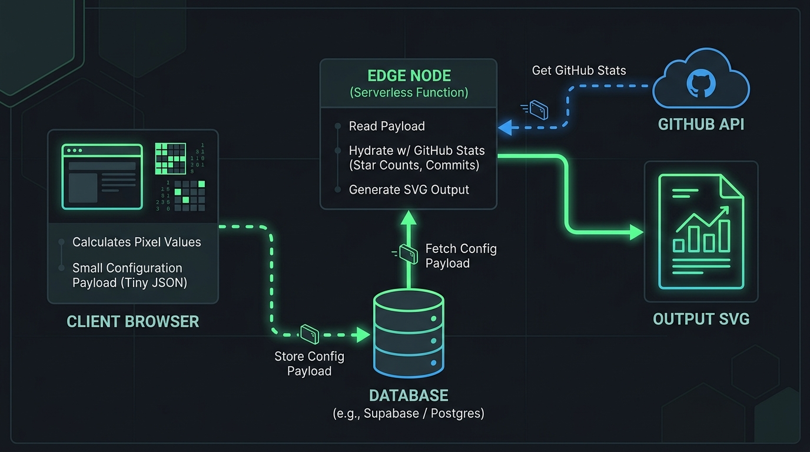

Monoliths are comfortable until they aren't. When building complex visual platforms, the architectural friction of a unified stack becomes immediately obvious under load.

This was the exact scenario we faced when engineering **GitAscii**—a platform designed to provide a highly aesthetic, editorial drag-and-drop builder for GitHub README profiles. The system had two entirely divergent responsibilities: intensive in-browser image-to-ASCII canvas processing, and high-throughput, edge-delivered dynamic SVGs.



### The Problem with Unified Rendering

Initially, it was tempting to handle image processing and template compilation in the same serverless function that served the final image. However, taking a high-res image, extracting pixel luminance, and mapping it to text matrices is computationally heavy. Doing this inside a Vercel serverless function triggered sporadic timeouts and degraded the Time-To-First-Byte (TTFB) to unacceptable levels, especially behind GitHub's strict Camo image proxy.

Under the hood, the image-to-ASCII algorithm loops through thousands of pixels. Here is the computational complexity we were dealing with on the server:

```typescript
// The pixel-processing bottleneck
export function imageToAscii(pixels: ImageData, width: number, height: number): string {
  let asciiStr = ''
  const chars = '@#S%?*+;:+=-,. '
  for (let y = 0; y < height; y += 2) {
    for (let x = 0; x < width; x++) {
      const idx = (y * width + x) * 4
      const r = pixels.data[idx]
      const g = pixels.data[idx + 1]
      const b = pixels.data[idx + 2]
      const gray = 0.2126 * r + 0.7152 * g + 0.0722 * b
      const charIdx = Math.floor((gray / 255) * (chars.length - 1))
      asciiStr += chars[charIdx]
    }
    asciiStr += '\n'
  }
  return asciiStr
}
```

Running this `O(N*M)` routine for every incoming HTTP request on a serverless cold start was a recipe for disaster. The CPU execution time rose linearly with the image size, exceeding Vercel's Edge runtime execution limit (50ms) and causing Gateway Timeouts (504).

### Decoupling as a Survival Strategy

Decoupling the visual React editor from the delivery engine wasn't just a best practice; it was the only viable survival strategy.

We split the application vertically:

1. **The Client Thread (Editor)**: We leveraged HTML5 Canvas directly in the browser. When a user uploads an image, the browser's own compute power calculates the ASCII matrix and saves it as a lightweight string payload in the configuration state.
2. **The Edge Engine (Delivery)**: The Next.js Edge API routes no longer process images. They simply fetch the pre-compiled layout state, hydrate it with live GitHub API statistics, and concatenate XML strings to form the SVG.



Here is how the Edge engine functions now. By using static JSON states, the route performs a single fetch and renders immediately:

```typescript
// Optimized Next.js Edge Route
export const runtime = 'edge'

export async function GET(request: Request) {
  const { searchParams } = new URL(request.url)
  const username = searchParams.get('user')

  // 1. Fetch lightweight pre-rendered ASCII state and layout configuration
  const layout = await db.getLayout(username)

  // 2. Fetch fresh stats in parallel (commits, languages, streaks)
  const stats = await fetchGitHubStats(username)

  // 3. Concatenate and return the SVG without heavy compute
  const svg = renderSvg(layout.asciiArt, stats)

  return new Response(svg, {
    headers: {
      'Content-Type': 'image/svg+xml',
      'Cache-Control': 'public, max-age=3600, s-maxage=3600, stale-while-revalidate=86400',
    },
  })
}
```

### Conclusion

By pushing the heavy lifting to the client during the editing phase, the edge endpoints became radically fast and lightweight. It’s a crucial lesson in distributed architecture: compute should happen where it is cheapest and most forgiving. In our case, the user's local browser was the perfect workhorse, leaving the Edge free to excel at what it does best—blazing fast content delivery.
