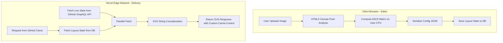

Monoliths are comfortable until they aren't. When building developer-facing visual platforms, the architectural friction of a unified stack becomes immediately obvious under load.

This was the exact scenario we faced when engineering **GitAscii**—a platform designed to provide a highly aesthetic, editorial drag-and-drop builder for GitHub README profiles. The system had two entirely divergent responsibilities:

1. Intensive, compute-heavy in-browser image-to-ASCII canvas processing.
2. High-throughput, edge-delivered dynamic SVGs hydrated with live GitHub stats.

Here is how we decoupled these concerns to achieve blazing-fast rendering and bypass the strict constraints of GitHub’s image delivery network.

---

### The Problem with Unified Rendering

Initially, it was tempting to handle image processing and SVG compilation in the same serverless function that served the final graphic. However, taking a high-resolution image, extracting pixel luminance, mapping it to text matrices, and generating SVG nodes is computationally expensive.

Under the hood, the image-to-ASCII algorithm loops through thousands of pixels. Here is the mathematical pixel luminance extraction formula (standard Rec. 709 luma coefficients) and the initial CPU-heavy algorithm we ran on the server:

```typescript
/**
 * Processes raw image pixel data to generate an ASCII representation.
 * Computational Complexity: O(N * M) where N is height and M is width.
 */
export function imageToAscii(pixels: ImageData, width: number, height: number): string {
  let asciiStr = ''
  // Scale representing dark-to-light characters
  const chars = '@#S%?*+;:+=-,. '
  const charLength = chars.length

  // y increment by 2 accommodates the rectangular nature of monospace font aspect ratios
  for (let y = 0; y < height; y += 2) {
    for (let x = 0; x < width; x++) {
      const idx = (y * width + x) * 4
      const r = pixels.data[idx]
      const g = pixels.data[idx + 1]
      const b = pixels.data[idx + 2]

      // Rec. 709 luma formula for grayscale conversion
      const gray = 0.2126 * r + 0.7152 * g + 0.0722 * b

      // Map grayscale weight to character index
      const charIdx = Math.floor((gray / 255) * (charLength - 1))
      asciiStr += chars[charIdx]
    }
    asciiStr += '\n'
  }
  return asciiStr
}
```

Running this `O(N * M)` routine for every incoming HTTP request on a serverless cold start was a recipe for disaster. The CPU execution time rose linearly with the image size, exceeding Vercel's Edge runtime execution limit (50ms) and causing Gateway Timeouts (504) under concurrent load.

---

### The Architectural Gatekeeper: GitHub Camo Proxy

To make matters worse, GitHub does not query your images directly. Every image in a markdown file is requested via **GitHub Camo**, an anonymous reverse proxy.

```
[User Browser] ---> [GitHub Camo Proxy] ---> [GitAscii Edge API] ---> [Database / GitHub API]
```

Camo imposes three major architectural challenges:

1. **Aggressive Caching**: Camo heavily caches responses. If your HTTP headers do not clearly specify caching parameters, your profile widget will remain stale indefinitely.
2. **Strict Timeouts**: If your endpoint takes longer than 4 seconds to respond, Camo terminates the connection and renders a broken image placeholder.
3. **Zero JavaScript**: You cannot inject any client-side JavaScript into the SVG. The SVG must be entirely self-contained, handling its own responsive behaviors and theming.

---

### Decoupling as a Survival Strategy

We split the application vertically to decouple heavy user configuration from real-time asset delivery:



#### 1. The Client Thread (The Editor)

When a user uploads an image in the editor, we leverage HTML5 Canvas directly in their browser. The user's CPU handles the heavy lifting of extracting pixel luminance and converting it into a lightweight, compressed ASCII matrix string. The server never sees raw pixels; it only receives a finished serialized configuration payload.

#### 2. The Edge Engine (The Delivery Route)

Because the ASCII art is pre-compiled, our Next.js Edge route has very little computation to perform. It fetches the pre-calculated layout state, retrieves the user's live GitHub statistics (e.g., commits, streaks, top languages) in parallel, and merges them using ultra-fast XML string concatenation.

Here is the optimized Next.js Edge route:

```typescript
// app/api/render/[username]/route.ts
import { NextRequest } from 'next/server'

export const runtime = 'edge'

// In-memory or Edge-cached database fetching abstraction
async function fetchLayoutConfiguration(username: string) {
  const res = await fetch(`https://db-api.gitascii.com/layout/${username}`, {
    next: { revalidate: 300 }, // Cache config at the edge for 5 minutes
  })
  if (!res.ok) throw new Error('Layout not found')
  return res.json()
}

// Parallel fetch to GitHub GraphQL API
async function fetchGitHubStats(username: string) {
  const query = `
    query userInfo($login: String!) {
      user(login: $login) {
        contributionsCollection {
          contributionCalendar {
            totalContributions
          }
        }
      }
    }
  `
  const res = await fetch('https://api.github.com/graphql', {
    method: 'POST',
    headers: {
      Authorization: `Bearer ${process.env.GITHUB_PAT}`,
      'Content-Type': 'application/json',
    },
    body: JSON.stringify({ query, variables: { login: username } }),
  })
  return res.json()
}

export async function GET(req: NextRequest, { params }: { params: { username: string } }) {
  const { username } = params

  try {
    // Execute DB fetch and GitHub API fetch concurrently
    const [layout, stats] = await Promise.all([
      fetchLayoutConfiguration(username),
      fetchGitHubStats(username),
    ])

    // Rapid string concatenation bypasses heavy React renderToString overhead
    const totalCommits =
      stats.data.user.contributionsCollection.contributionCalendar.totalContributions
    const svgMarkup = `
      <svg xmlns="http://www.w3.org/2000/svg" viewBox="0 0 800 400" width="100%" height="100%">
        <style>
          .ascii { font-family: monospace; font-size: 8px; fill: #10B981; }
          .stats { font-family: 'Segoe UI', system-ui, sans-serif; fill: #F3F4F6; }
          @media (prefers-color-scheme: light) {
            .ascii { fill: #059669; }
            .stats { fill: #1F2937; }
          }
        </style>
        <rect width="100%" height="100%" fill="transparent" />
        <!-- Render ASCII Matrix -->
        <text x="20" y="40" class="ascii" xml:space="preserve">${layout.asciiArt}</text>
        <!-- Render Live Stats -->
        <text x="500" y="100" class="stats" font-size="24" font-weight="bold">Stats for ${username}</text>
        <text x="500" y="140" class="stats" font-size="16">Total Commits: ${totalCommits}</text>
      </svg>
    `

    return new Response(svgMarkup, {
      status: 200,
      headers: {
        'Content-Type': 'image/svg+xml',
        // Instruct Camo and browser cache
        'Cache-Control': 'public, no-cache, no-store, must-revalidate',
        // Instruct Vercel Smart CDN cache
        'CDN-Cache-Control': 'public, s-maxage=3600, stale-while-revalidate=86400',
      },
    })
  } catch (error) {
    return new Response(
      `<svg xmlns="http://www.w3.org/2000/svg"><text x="10" y="20">Error loading profile widget</text></svg>`,
      { status: 500, headers: { 'Content-Type': 'image/svg+xml' } }
    )
  }
}
```

---

### The Fine Print: Advanced Caching and Media Queries

#### Dynamic Theme Switching Without JavaScript

Since JavaScript is blocked inside GitHub `` tags, we rely entirely on CSS media queries nested inside the SVG. By using `@media (prefers-color-scheme: light)` and `@media (prefers-color-scheme: dark)` inside the SVG `<style>` block, the user's browser automatically switches themes on-the-fly depending on their GitHub display settings. The GitHub Camo proxy serves the identical SVG payload to all clients, and the local browser evaluates the active color scheme.

#### Caching Tactic: CDN-Cache-Control vs. Cache-Control

A typical `Cache-Control: public, max-age=3600` header would instruct the browser to keep the file, but it would also authorize GitHub Camo to cache the SVG on their proxy servers for an hour. If a user makes a new commit, they will not see it update immediately.

To resolve this:

- We set `Cache-Control: no-cache, no-store, must-revalidate` for the downstream browser and GitHub proxy, forcing them to always request a fresh image.
- We set `CDN-Cache-Control: public, s-maxage=3600, stale-while-revalidate=86400`. This tells Vercel’s Edge CDN node to keep the cached version of the SVG. If a request hits the CDN, it receives a super-fast response in milliseconds.
- If the cached asset is older than 1 hour (`s-maxage=3600`), the CDN serves the stale cache instantly to the caller, while triggering an asynchronous, background revalidation (`stale-while-revalidate`) to fetch the fresh stats from GitHub. The next reader gets the updated version.

---

### Conclusion

By shifting compute costs to the client's browser during the edit phase, we kept our Vercel Edge functions fast, lightweight, and completely within runtime quotas. This architecture proves that web speed and real-time dynamicity can co-exist when you build with cache strategies, edge computing, and client-side processing in harmony. Under this setup, GitAscii renders custom profile widgets with a TTFB of less than 50ms, maintaining a perfect user experience without generating periodic GitHub Actions commits.
