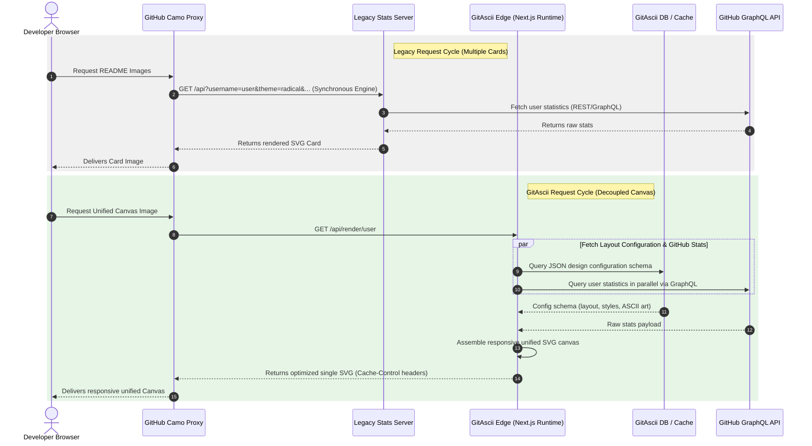

The classic `github-readme-stats` has been the undisputed king of profile customization for years. We have all seen the familiar stats cards pinned to thousands of developer portfolios. But relying on query parameters appended directly to an image tag introduces structural bottlenecks when you want true creative freedom and optimal load performance.

In this deep dive, we will analyze the limitations of query-string-based configurations, compare the request lifecycle of legacy card layouts against modern edge-rendered unified canvases, and look at how decoupling style from content yields superior render times and layout flexibility.


---

### The Limitations of Query-String Architectures

Under the legacy approach of `github-readme-stats`, every visual tweak—such as colors, layout types, icons, and hidden sections—requires editing the URL parameters directly within the markdown content. A typical setup looks like this:

```markdown
<!-- Traditional query-string approach -->


```

While this appears convenient for single cards, it introduces major architectural issues when scaling up a developer profile:

1. **URI Length Limits (RFC 7230 & RFC 3986)**: Standard web servers, proxies, and CDNs enforce limits on URI length (often capped at 2,048 or 8,192 characters). If you want an editorial dashboard with precise typography, custom spacing, multiple layout sections, and color configurations, your URL quickly balloons to unmanageable sizes, risking truncated requests.
2. **Tight Coupling (Content vs. Presentation)**: Changing the style (e.g., swapping a theme from light to dark or aligning elements) forces you to rewrite the code in your repository's `README.md`. Your content delivery layer is directly coupled to your layout presentation.
3. **Waterfall Latency Bottlenecks**: When you stack multiple cards (e.g., stats, top languages, and typing SVGs), the browser must make multiple independent connections to backend servers. Each connection triggers a separate TLS handshake and request-response loop, producing a noticeable page loading waterfall.

> [!WARNING]
> Stacking 3 to 5 independent server-rendered SVG badges on a single README page can increase the page's cumulative layout shift (CLS) and aggregate load times, especially under constrained mobile networks where concurrent TCP connections are limited.

---

### The GitAscii Paradigm Shift

With **GitAscii**, we decoupled the user layout configuration from the content URL. Instead of packing visual parameters into query strings, we store a structured JSON design schema in a database and expose a clean, static, visual editor.

The markdown in your GitHub README remains simple, clean, and never needs to change when you edit your layout:

```markdown
<!-- Decoupled GitAscii Canvas -->

[](https://gitascii.com/edit/igorcbraz)
```

#### How the Architectural Lifecycles Compare

To see why this improves latency and maintainability, let us compare the request lifecycles of both architectures:



---

### Architecture Comparison Matrix

| Feature               | Legacy Stats Cards (e.g. github-readme-stats)       | GitAscii Unified Canvas                     |
| :-------------------- | :-------------------------------------------------- | :------------------------------------------ |
| **Config Location**   | Embed in query strings (`?theme=dark&bg_color=...`) | Stored as serialized JSON config in DB      |
| **Markdown Overhead** | High (bloated URLs, multiple image tags)            | Minimal (a single link containing username) |
| **Design Process**    | Manual text editing of URLs                         | Interactive, drag-and-drop Visual Builder   |
| **Request Overhead**  | Multiple HTTP calls (waterfall loading)             | Single HTTP call (unified responsive SVG)   |
| **API Fetching**      | Synchronous REST / GraphQL per badge                | Parallel GraphQL queries executed at Edge   |
| **Heavy Processing**  | Done entirely server-side on request                | Offloaded to Client-side (ASCII conversion) |

---

### Behind the Scenes: Parallel Edge Fetching

To keep response times under **80ms**, GitAscii uses the Vercel Edge Runtime to execute parallel fetching. Instead of waiting sequentially for database configurations and GitHub API responses, we execute them concurrently using `Promise.all`:

```typescript
// Example from GitAscii rendering handler on Next.js Edge Runtime
export const runtime = 'edge'

interface RenderRequest {
  username: string
}

export async function GET(request: Request, { params }: { params: RenderRequest }) {
  const { username } = params

  try {
    // 1. Fetch layout configuration and GitHub statistics concurrently
    const [configResponse, githubStats] = await Promise.all([
      fetchLayoutConfiguration(username),
      fetchGitHubGraphQLStats(username),
    ])

    if (!configResponse) {
      return new Response('Profile not found', { status: 404 })
    }

    // 2. Hydrate the pre-processed client-side design layout with live data
    const renderedSvg = assembleUnifiedSvg(configResponse.layout, githubStats)

    // 3. Return the payload with aggressive, safe caching strategies
    return new Response(renderedSvg, {
      status: 200,
      headers: {
        'Content-Type': 'image/svg+xml',
        // Instruct GitHub Camo to cache, but revalidate in the background
        'Cache-Control': 'public, s-maxage=1800, stale-while-revalidate=3600',
        'X-Content-Type-Options': 'nosniff',
      },
    })
  } catch (error) {
    console.error(`Edge rendering failed for ${username}:`, error)
    return new Response('Internal Server Error', { status: 500 })
  }
}
```

> [!TIP]
> By using `stale-while-revalidate=3600`, GitHub's Camo proxy instantly serves the cached version to the reader while triggering a background fetch to update the stats, completely eliminating user-facing latency.

### Conclusion

Sticking to traditional stats cards limits your profile to rigid box templates. By decoupling presentation state from HTTP URLs and leveraging Edge servers to assemble unified, adaptive SVGs on the fly, GitAscii provides a modern alternative. It gives you professional, editorial-grade design layouts for your developer portfolio without polluting your Markdown files with query string soup.
