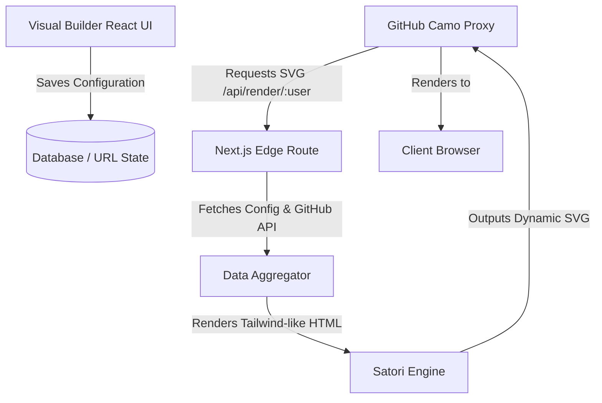

# GitAscii: A Visual Editor for GitHub Profile READMEs

Your GitHub profile is your digital business card in the open-source community. However, maintaining a profile README that is visually striking, informative, and dynamically updated often turns into a tedious chore. Developers are forced to choose between manually editing Markdown files, relying on multiple mismatched third-party statistics generators, or dealing with broken alignments on mobile devices.

**GitAscii** solves this problem by introducing a unified, visual drag-and-drop workspace. Instead of writing nested HTML tables or configuring multiple external repositories, you construct your profile visually. The editor generates a configuration schema, which is compiled on-demand into a single, highly optimized, theme-responsive SVG.

---

## The Core Problem: Why Profile READMEs Are Fragile

Building a custom profile README presents several technical challenges:

1. **GitHub Camo Proxying**: GitHub routes all README images through `camo.githubusercontent.com` to prevent mixed-content warnings and trace user IP addresses. This proxy caches images aggressively, meaning any dynamic stats must declare strict caching policies or risk serving stale data.
2. **Responsive Alignment**: Markdown doesn't natively support grid layouts or advanced flexbox styling. Creating a multi-column layout with status badges, coding stats, and bio sections requires writing raw HTML `<table>` or `<div>` structures that frequently break on narrow screens.
3. **Theme Synchronization**: GitHub supports light and dark themes. Most external badge generators return flat images with hardcoded background colors, rendering them illegible when a user toggles their GitHub interface theme.
4. **Maintenance Overhead**: Keeping metrics up-to-date (like recent blog posts, current repository stars, or Spotify listening state) requires background cron jobs or GitHub Actions that push commits to your profile repository, cluttering your Git history.

---

## The GitAscii Architecture

GitAscii combines a browser-based layout engine with an Edge-hosted rendering pipeline to bypass these limitations.



### 1. The Visual Editor (Client-Side)

Built using **Next.js**, **React**, and **Tailwind CSS**, the editor enables you to arrange layout elements (widgets) on a grid canvas. The layout is stored as a JSON schema, defining positions, dimensions, widget types, and user configuration.

### 2. Edge Rendering & Caching Pipeline

Instead of rendering HTML to client-side browsers and making users download hundreds of kilobytes of JavaScript, GitAscii serves a single `` URL. When GitHub Camo requests this URL, our serverless Edge handler fetches the user's layout schema, aggregates live statistics from the GitHub API, and compiles the components using [Satori](https://github.com/vercel/satori). Satori converts HTML/CSS elements styled with Tailwind inline-styles into standard, clean SVG paths.

### 3. Dynamic Caching & Bypassing Camo Latency

To balance fast load times and fresh stats, GitAscii uses a tailored cache invalidation strategy. We leverage the `Cache-Control` header to control how the GitHub Camo proxy and the user's browser handle the asset.

```http
Cache-Control: public, max-age=0, s-maxage=300, stale-while-revalidate=600
```

- **`max-age=0`**: Instructs the user's browser not to cache the image, ensuring that returning to the page triggers a re-fetch.
- **`s-maxage=300`**: Tells GitHub Camo to cache the SVG for exactly 5 minutes (300 seconds).
- **`stale-while-revalidate=600`**: Allows Camo to serve the stale cached SVG immediately while fetching the fresh version in the background, minimizing TTFB (Time to First Byte) latency for the visitor.

---

## Technical Deep Dive: Browser-Side ASCII Art Conversion

One of GitAscii’s unique widgets is the client-side ASCII art converter. Users can upload an image, and GitAscii converts it into a terminal-style monochrome or colored text representation.

To achieve this without server-side processing overhead, we perform canvas manipulation directly in the browser using the following JavaScript logic:

```typescript
/**
 * Converts a source image file into an ASCII string based on pixel luminance.
 *
 * @param imageEl - The loaded HTMLImageElement.
 * @param cols - Number of columns in the target ASCII art (controls horizontal resolution).
 * @param rows - Number of rows in the target ASCII art (controls vertical resolution).
 * @returns The converted ASCII text.
 */
export function convertImageToAscii(imageEl: HTMLImageElement, cols: number, rows: number): string {
  const canvas = document.createElement('canvas')
  const ctx = canvas.getContext('2d')
  if (!ctx) return ''

  // Set visual dimensions to match target resolution
  canvas.width = cols
  canvas.height = rows

  // Draw image scaled down to columns * rows
  ctx.drawImage(imageEl, 0, 0, cols, rows)

  // Retrieve raw RGBA pixel data
  const imgData = ctx.getImageData(0, 0, cols, rows)
  const data = imgData.data

  // ASCII character ramp ordered from densest (darkest) to sparsest (lightest)
  const charRamp = '@#S%?*+;:+,. '
  const rampLength = charRamp.length
  let asciiResult = ''

  for (let y = 0; y < rows; y++) {
    for (let x = 0; x < cols; x++) {
      const idx = (y * cols + x) * 4
      const r = data[idx]
      const g = data[idx + 1]
      const b = data[idx + 2]
      const a = data[idx + 3]

      // If pixel is fully transparent, treat it as whitespace
      if (a < 10) {
        asciiResult += ' '
        continue
      }

      // Calculate relative luminance using standard Rec. 709 weights
      const luminance = 0.2126 * r + 0.7152 * g + 0.0722 * b

      // Map luminance (0-255) to a character index in the ramp
      const charIndex = Math.floor((luminance / 255) * (rampLength - 1))
      asciiResult += charRamp[charIndex]
    }
    // Append newline at the end of each row
    asciiResult += '\n'
  }

  return asciiResult
}
```

> [!NOTE]
> Since standard text characters are taller than they are wide, we recommend correcting the aspect ratio by reducing the vertical row count (`rows`) relative to `cols` by a factor of roughly `0.55` before rendering to prevent the ASCII art from stretching vertically.

---

## Achieving Theme Responsiveness in Generated SVGs

To adapt to GitHub's light and dark themes seamlessly, GitAscii inserts a dynamic CSS stylesheet block inside the generated SVG file. By utilizing the standard system media queries within the SVG definition itself, we target GitHub's system theme variables:

```xml
<svg xmlns="http://www.w3.org/2000/svg" viewBox="0 0 800 400" width="100%" height="100%">
  <style>
    /* Default dark theme values */
    .bg { fill: #0d1117; }
    .text-primary { fill: #c9d1d9; font-family: 'Fira Code', monospace; }
    .text-accent { fill: #58a6ff; font-weight: bold; }

    /* Override rules when light mode is preferred */
    @media (prefers-color-scheme: light) {
      .bg { fill: #ffffff; }
      .text-primary { fill: #24292f; }
      .text-accent { fill: #0969da; }
    }
  </style>

  <!-- Background Layer -->
  <rect class="bg" width="100%" height="100%" rx="8" />

  <!-- Dynamic Content -->
  <text x="40" y="60" class="text-accent" font-size="24">GitAscii Dashboard</text>
  <text x="40" y="100" class="text-primary" font-size="16">> Initializing widgets...</text>
</svg>
```

When GitHub’s container renders this inline or via an `` tag, the user’s client browser processes the `@media` query and instantly shifts colors without requesting a new asset from the server.

---

## Join the Project

GitAscii is completely open-source and built for developers who want absolute control over their profiles without writing thousands of lines of boilerplate Markdown.

> [!TIP]
> You can host GitAscii yourself! The application is packaged to run within Vercel Serverless Functions, Netlify, or standard Docker containers. Check out our repository instructions on self-hosting config variables to spin up a private instance with custom GitHub OAuth scopes.

- **Repository**: [https://github.com/Igorcbraz/GitAscii](https://github.com/Igorcbraz/GitAscii)
- **Visual Editor**: [https://gitascii.com](https://gitascii.com)
