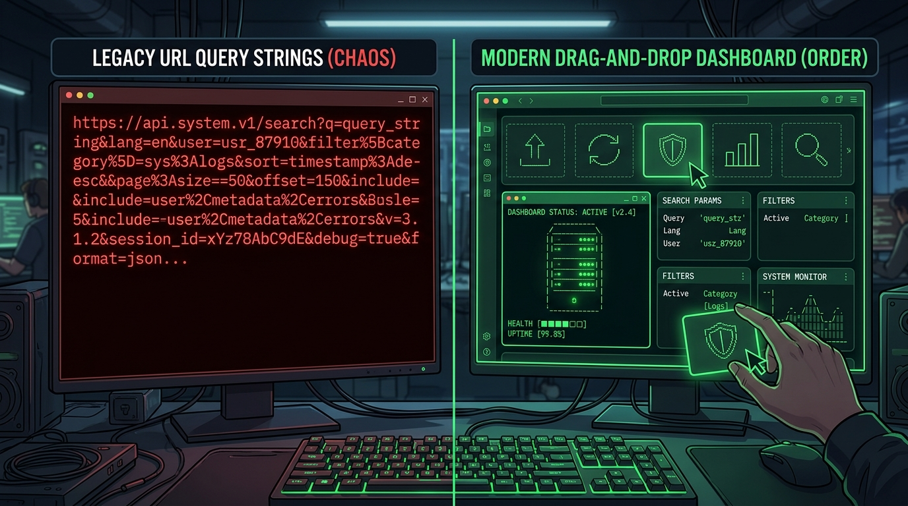

The classic `github-readme-stats` has been the undisputed king of profile customization for years. We've all seen the familiar stats cards pinned to thousands of repositories and profiles. But relying on query parameters appended to an image tag has structural limits when you want true creative freedom.



When you want a complete, highly aesthetic visual canvas—something that looks like an editorial newspaper design rather than a standard isolated card—you traditionally had two choices: settle for static markdown, or write a messy cron job that pollutes your commit history with automated commits.

### The Limits of Query Parameter Architectures

Under `github-readme-stats`, every single modification to your card's visual style requires editing the query parameters directly in your README's markdown. A typical setup looks like this:

```markdown
<!-- Traditional query string hell -->


```

This approach has multiple flaws:

1. **URI Length Limits**: Browsers and HTTP servers limit URL lengths. If you want a complex dashboard with multiple custom layouts, typography controls, and alignment spacing, your URL becomes unmanageable and gets cut off.
2. **Tight Coupling**: Your styling information (colors, layouts, themes) is embedded directly inside the content layer (the README markdown). Changing your theme means updating the markdown file itself.
3. **No Cohesive Canvas**: Each card is isolated. You cannot easily align text, ASCII art, and status components into a unified grid that responds as a single editorial page layout.

### The GitAscii Paradigm Shift

With **GitAscii**, we wanted to change this paradigm entirely. Instead of passing configuration through massive URLs, GitAscii provides a drag-and-drop canvas (think Figma for your README). You build your layout visually, adding terminal widgets, charts, and ASCII art.

Instead of parsing a complex query string at request time, GitAscii serializes your entire design schema as a single JSON configuration object stored in a lightweight database. The markdown in your README is simple and static:

```markdown
<!-- Decoupled GitAscii link -->

[](https://gitascii.com/edit/igorcbraz)
```

When GitHub’s proxy requests this image, Vercel Edge nodes retrieve the JSON configuration, fetch current statistics from the GitHub GraphQL API in parallel, and dynamically generate a single, unified, responsive SVG file.

| Feature              | github-readme-stats         | GitAscii                          |
| -------------------- | --------------------------- | --------------------------------- |
| **Design Interface** | Query Parameters            | Drag-and-drop Visual Editor       |
| **Styling Location** | Inside markdown file        | Decoupled database state          |
| **Output Type**      | Individual cards            | Cohesive editorial canvas / grid  |
| **Heavy Processing** | Done synchronous on request | Pre-processed client-side (ASCII) |

### Conclusion

Sticking to traditional stats cards limits your GitHub profile to template boxes. By decoupling configuration from the HTTP URL and utilizing Edge servers to assemble unified, adaptive SVGs on the fly, GitAscii provides a modern alternative that brings professional, editorial-grade design to your GitHub portfolio without the markdown spaghetti.
