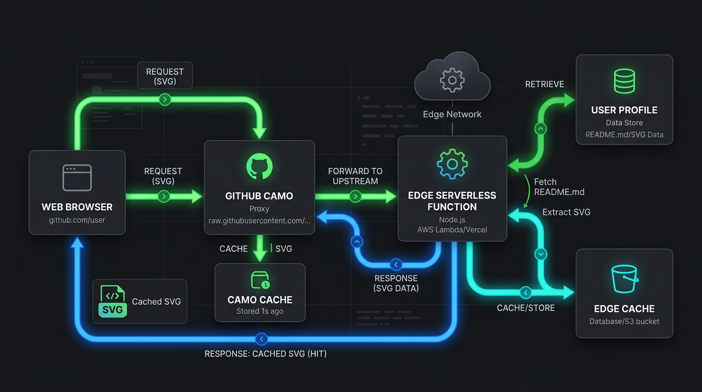

Ferramentas clássicas de customização de perfis como o `readme-typing-svg` popularizaram a injeção de animações e interatividade em repositórios, servindo SVGs remotos gerados de forma dinâmica. Porém, o custo oculto dessa abordagem síncrona é a degradação da percepção de performance (FCP) devido a timeouts ocasionais e à forma como o proxy GitHub Camo lida com quebra de cache e fallback.


### O gargalo do processamento síncrono clássico

Uma requisição para um serviço tradicional de SVG dinâmico precisa renderizar fontes personalizadas, calcular layouts e montar frames de animação. Quando isso ocorre em servidores tradicionais (como instâncias gratuitas do Render ou Heroku), o tempo de resposta pode facilmente flertar com a janela de tolerância máxima do GitHub Camo (aproximadamente 4 a 10 segundos). Se o servidor sofrer um _cold start_, a conexão cai, resultando em imagens quebradas no README.

No modelo clássico:

1. O navegador do usuário solicita o README do GitHub.
2. O GitHub substitui os links de imagem pelo proxy Camo (`https://camo.githubusercontent.com/...`).
3. O proxy Camo faz uma requisição HTTP síncrona ao servidor da ferramenta.
4. O servidor da ferramenta inicializa a renderização da animação SVG, calcula as larguras dos textos com base nas fontes e devolve o XML.
5. Se esse processo demorar mais de alguns segundos, o Camo desiste e serve uma imagem quebrada de timeout.

### Deslocamento da carga de processamento no GitAscii

Ao projetarmos o **GitAscii**, a escolha arquitetural deliberada foi separar o peso de processamento da entrega de dados. Ferramentas legadas tentam fazer todo o trabalho pesado no momento exato da requisição HTTP (`GET /image.svg?text=Hello`).

No GitAscii, deslocamos a carga pesada de composição (como a geração de ASCII art customizada a partir de fotos de perfil) estritamente para o client-side do editor visual. Usamos a `Canvas API` do navegador para ler e processar os pixels na thread local do usuário enquanto ele monta a sua interface:

```javascript
// Exemplo conceitual do processamento de pixels no client-side
const canvas = document.createElement('canvas')
const ctx = canvas.getContext('2d')
ctx.drawImage(img, 0, 0, width, height)
const imgData = ctx.getImageData(0, 0, width, height)

// O processamento de luminância ocorre localmente na máquina do usuário:
const asciiString = computeAsciiMatrix(imgData)
// Enviamos apenas a string resultante (leve) para o banco de dados
await saveProfileLayout({ userId, asciiString })
```

Esse design significa que o Edge fica responsável _apenas_ pela montagem de um markup XML pré-calculado e pela hidratação rápida de dados numéricos (como commits e estrelas de repositórios).



Quando o proxy Camo do GitHub solicita a imagem no Vercel Edge, a rota do Next.js executa em menos de 50ms:

```typescript
// Renderizador simplificado executando no Vercel Edge Runtime
export const runtime = 'edge'

export async function GET(req: Request) {
  // Apenas concatenação rápida de strings XML. Sem cálculo de layout pesado ou conversão de imagens.
  const cachedLayout = await getCachedLayout(req)
  const liveData = await fetchGitHubStats(cachedLayout.userId)

  const svg = `<svg xmlns="http://www.w3.org/2000/svg" width="800" height="400">
    <style>...</style>
    <text x="10" y="20">${liveData.commits} Commits</text>
    <pre>${cachedLayout.asciiString}</pre>
  </svg>`

  return new Response(svg, {
    headers: {
      'Content-Type': 'image/svg+xml',
      'Cache-Control': 'public, s-maxage=3600, stale-while-revalidate=86400',
    },
  })
}
```

### Conclusão

Essa mudança de paradigma garante que o TTFB (Time To First Byte) fique consistentemente abaixo dos 50-80ms nas rotas Edge do Next.js, impedindo que o proxy do GitHub aborte a conexão. Ao otimizar o fluxo de cache utilizando os headers `s-maxage` e `stale-while-revalidate`, garantimos estabilidade operacional mesmo sob picos massivos de tráfego que costumam derrubar cartões dinâmicos clássicos de perfil.
