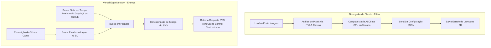

Monólitos são confortáveis até deixarem de ser. Ao construir plataformas visuais voltadas para desenvolvedores, a fricção arquitetural de uma stack unificada torna-se imediatamente óbvia sob carga.

Este foi o cenário exato que enfrentamos ao projetar o **GitAscii**—uma plataforma desenvolvida para fornecer um editor visual arrasta-e-solta (drag-and-drop) para perfis README do GitHub. O sistema possuía duas responsabilidades inteiramente divergentes:

1. Processamento intensivo de imagem para ASCII via canvas diretamente no navegador.
2. SVGs dinâmicos de alto rendimento, entregues no Edge e hidratados com estatísticas em tempo real do GitHub.

Veja como desacoplamos essas responsabilidades para obter uma renderização extremamente rápida e contornar as restrições estritas da rede de entrega de imagens do GitHub.

---

### O Problema com a Renderização Unificada

Inicialmente, era tentador processar a imagem e compilar o SVG na mesma função serverless encarregada de servir o gráfico final. No entanto, receber uma imagem de alta resolução, extrair a luminância dos pixels, mapeá-la para matrizes de texto e gerar os nós do SVG é um processo computacionalmente caro.

Por baixo dos panos, o algoritmo de conversão de imagem para ASCII faz um laço de repetição por milhares de pixels. Abaixo está a fórmula matemática de extração de luminância de pixel (coeficientes de luma padrão Rec. 709) e o algoritmo original com uso intensivo de CPU que rodávamos no servidor:

```typescript
/**
 * Processa dados brutos de pixels de imagem para gerar uma representação em ASCII.
 * Complexidade Computacional: O(N * M) onde N é a altura e M é a largura.
 */
export function imageToAscii(pixels: ImageData, width: number, height: number): string {
  let asciiStr = ''
  // Escala representando caracteres do mais escuro ao mais claro
  const chars = '@#S%?*+;:+=-,. '
  const charLength = chars.length

  // O incremento de y em 2 compensa a proporção retangular das fontes monoespaçadas
  for (let y = 0; y < height; y += 2) {
    for (let x = 0; x < width; x++) {
      const idx = (y * width + x) * 4
      const r = pixels.data[idx]
      const g = pixels.data[idx + 1]
      const b = pixels.data[idx + 2]

      // Fórmula de luma Rec. 709 para conversão em escala de cinza
      const gray = 0.2126 * r + 0.7152 * g + 0.0722 * b

      // Mapeia o peso de cinza para o índice do caractere correspondente
      const charIdx = Math.floor((gray / 255) * (charLength - 1))
      asciiStr += chars[charIdx]
    }
    asciiStr += '\n'
  }
  return asciiStr
}
```

Executar essa rotina `O(N * M)` para cada requisição HTTP em um cold start de função serverless era uma receita para o desastre. O tempo de execução de CPU subia linearmente com o tamanho da imagem, ultrapassando o limite de execução do runtime Edge da Vercel (50ms) e causando Timeouts de Gateway (504) sob carga concorrente.

---

### O Guardião Arquitetural: Proxy GitHub Camo

Para piorar a situação, o GitHub não requisita suas imagens diretamente. Cada imagem em um arquivo markdown é solicitada por meio do **GitHub Camo**, um proxy reverso anônimo.

```
[Navegador do Usuário] ---> [Proxy GitHub Camo] ---> [API GitAscii Edge] ---> [Banco de Dados / API do GitHub]
```

O Camo impõe três grandes desafios arquiteturais:

1. **Cache Agressivo**: O Camo armazena as respostas em cache de forma agressiva. Se os seus headers HTTP não especificarem claramente os parâmetros de cache, o widget do perfil ficará desatualizado indefinidamente.
2. **Timeouts Estritos**: Se o seu endpoint demorar mais de 4 segundos para responder, o Camo encerra a conexão e renderiza um placeholder de imagem quebrada.
3. **Zero JavaScript**: Não é possível injetar JavaScript no lado do cliente dentro do SVG. O SVG deve ser totalmente autônomo, lidando com seus próprios estilos responsivos e temas.

---

### Desacoplamento como Estratégia de Sobrevivência

Dividimos a aplicação verticalmente para desacoplar a configuração pesada feita pelo usuário da entrega de assets em tempo real:



#### 1. A Thread do Cliente (O Editor)

Quando um usuário faz o upload de uma imagem no editor, utilizamos o HTML5 Canvas diretamente no navegador dele. A CPU do usuário assume o trabalho pesado de extrair a luminância dos pixels e convertê-la em uma string compacta de matriz ASCII. O servidor nunca chega a ver os pixels brutos; ele apenas recebe o payload final de configuração serializada.

#### 2. O Engine no Edge (A Rota de Entrega)

Como a arte ASCII já está pré-compilada, nossa rota Next.js Edge tem pouquíssimo trabalho computacional a fazer. Ela busca o estado de layout pré-calculado no banco de dados, recupera em paralelo as estatísticas em tempo real do usuário no GitHub (como commits, streaks, principais linguagens) e faz a junção das informações por meio de uma rápida concatenação de strings XML.

Aqui está a rota Next.js Edge otimizada:

```typescript
// app/api/render/[username]/route.ts
import { NextRequest } from 'next/server'

export const runtime = 'edge'

// Abstração de busca no banco de dados com cache no Edge
async function fetchLayoutConfiguration(username: string) {
  const res = await fetch(`https://db-api.gitascii.com/layout/${username}`, {
    next: { revalidate: 300 }, // Cache do layout no Edge por 5 minutos
  })
  if (!res.ok) throw new Error('Layout não encontrado')
  return res.json()
}

// Busca paralela na API GraphQL do GitHub
async function fetchGitHubStats(username: string) {
  const query = `
    query userInfo($login: String!) {
      user(login: $login) {
        contributionsCollection {
          contributionCalendar {
            totalContributions
          }
        }
      }
    }
  `
  const res = await fetch('https://api.github.com/graphql', {
    method: 'POST',
    headers: {
      Authorization: `Bearer ${process.env.GITHUB_PAT}`,
      'Content-Type': 'application/json',
    },
    body: JSON.stringify({ query, variables: { login: username } }),
  })
  return res.json()
}

export async function GET(req: NextRequest, { params }: { params: { username: string } }) {
  const { username } = params

  try {
    // Executa a busca no BD e na API do GitHub concorrentemente
    const [layout, stats] = await Promise.all([
      fetchLayoutConfiguration(username),
      fetchGitHubStats(username),
    ])

    // Concatenação rápida de strings ignora o overhead do renderToString do React
    const totalCommits =
      stats.data.user.contributionsCollection.contributionCalendar.totalContributions
    const svgMarkup = `
      <svg xmlns="http://www.w3.org/2000/svg" viewBox="0 0 800 400" width="100%" height="100%">
        <style>
          .ascii { font-family: monospace; font-size: 8px; fill: #10B981; }
          .stats { font-family: 'Segoe UI', system-ui, sans-serif; fill: #F3F4F6; }
          @media (prefers-color-scheme: light) {
            .ascii { fill: #059669; }
            .stats { fill: #1F2937; }
          }
        </style>
        <rect width="100%" height="100%" fill="transparent" />
        <!-- Renderiza a Matriz ASCII -->
        <text x="20" y="40" class="ascii" xml:space="preserve">${layout.asciiArt}</text>
        <!-- Renderiza as Estatísticas -->
        <text x="500" y="100" class="stats" font-size="24" font-weight="bold">Stats de ${username}</text>
        <text x="500" y="140" class="stats" font-size="16">Total de Commits: ${totalCommits}</text>
      </svg>
    `

    return new Response(svgMarkup, {
      status: 200,
      headers: {
        'Content-Type': 'image/svg+xml',
        // Instrui o navegador do cliente e o Camo a não guardarem em cache local
        'Cache-Control': 'public, no-cache, no-store, must-revalidate',
        // Instrui a CDN inteligente da Vercel a gerenciar o cache
        'CDN-Cache-Control': 'public, s-maxage=3600, stale-while-revalidate=86400',
      },
    })
  } catch (error) {
    return new Response(
      `<svg xmlns="http://www.w3.org/2000/svg"><text x="10" y="20">Erro ao carregar o widget do perfil</text></svg>`,
      { status: 500, headers: { 'Content-Type': 'image/svg+xml' } }
    )
  }
}
```

---

### Os Detalhes Técnicos: Caching Avançado e Media Queries

#### Troca Dinâmica de Temas sem JavaScript

Como scripts são bloqueados dentro de tags `` do GitHub, dependemos inteiramente de media queries CSS embutidas no próprio SVG. Usando `@media (prefers-color-scheme: light)` e `@media (prefers-color-scheme: dark)` no bloco `<style>` do SVG, o navegador do usuário troca as cores de forma autônoma de acordo com o tema configurado no GitHub. O proxy Camo serve o mesmo payload de SVG para todos os clientes, e o navegador local resolve o esquema cromático ativo.

#### Tática de Cache: CDN-Cache-Control vs. Cache-Control

Um header comum do tipo `Cache-Control: public, max-age=3600` diria para o navegador do leitor guardar o arquivo, mas também autorizaria o GitHub Camo a cachear o SVG em seus servidores por uma hora. Se o usuário fizesse um commit nesse intervalo, a imagem não atualizaria imediatamente.

Para resolver isso:

- Definimos `Cache-Control: no-cache, no-store, must-revalidate` para o navegador final e o proxy do GitHub, forçando-os a solicitar sempre uma nova imagem.
- Definimos `CDN-Cache-Control: public, s-maxage=3600, stale-while-revalidate=86400`. Isso diz à CDN no Edge da Vercel para reter a versão cacheada. Se uma requisição bater na CDN, o SVG é retornado instantaneamente em milissegundos.
- Se o asset em cache tiver mais de 1 hora (`s-maxage=3600`), a CDN serve a versão antiga instantaneamente para o solicitante e dispara uma revalidação assíncrona (`stale-while-revalidate`) em segundo plano para buscar novos dados no GitHub. O próximo visitante recebe o gráfico atualizado.

---

### Conclusão

Ao mover o custo computacional pesado para o navegador do usuário durante a edição, mantivemos as funções no Edge leves, velozes e totalmente dentro das cotas de runtime. Essa arquitetura comprova que performance na web e dinamismo em tempo real podem coexistir quando combinamos estratégias inteligentes de cache, computação no Edge e processamento no cliente. Com esse fluxo, o GitAscii entrega widgets dinâmicos com tempo de resposta (TTFB) abaixo de 50ms, oferecendo uma experiência fantástica sem poluir o histórico do Git com commits automatizados.
