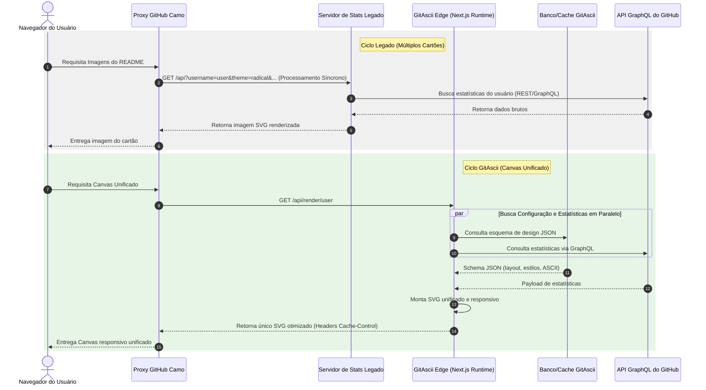

O clássico `github-readme-stats` é o rei indiscutível da personalização de perfis há anos. Todos nós já vimos os familiares cartões de estatísticas fixados em milhares de portfólios de desenvolvedores. No entanto, depender de parâmetros de query string anexados diretamente a uma tag de imagem introduz gargalos estruturais quando você busca verdadeira liberdade criativa e tempos de carregamento otimizados.

Nesta análise técnica detalhada, investigaremos as limitações das configurações baseadas em query strings, compararemos o ciclo de vida das requisições entre os layouts legados e as telas integradas renderizadas no Edge, e veremos como o desacoplamento de estilo e conteúdo resulta em tempos de resposta muito mais baixos e alta flexibilidade de layout.


---

### As Limitações das Arquiteturas baseadas em Query String

Sob a abordagem tradicional do `github-readme-stats`, qualquer ajuste visual—como cores, tipos de layout, ícones ou seções ocultas—exige a edição direta dos parâmetros de URL no próprio arquivo Markdown. Um exemplo típico de configuração é:

```markdown
<!-- Abordagem tradicional baseada em query-string -->


```

Embora pareça prático para um único cartão, este modelo introduz problemas de arquitetura significativos à medida que o seu perfil escala:

1. **Limites de Tamanho de URI (RFC 7230 e RFC 3986)**: Servidores web, proxies e CDNs impõem limites rígidos ao tamanho de URIs (geralmente limitados entre 2.048 e 8.192 caracteres). Se você deseja montar um dashboard editorial com tipografia precisa, espaçamento personalizado, várias seções e paleta de cores detalhada, sua URL cresce descontroladamente, correndo o risco de ser truncada ou rejeitada.
2. **Acoplamento Forte (Conteúdo vs. Apresentação)**: Alterar o visual (ex: mudar o tema de claro para escuro ou ajustar o alinhamento de um bloco) obriga você a modificar e realizar commits no arquivo `README.md` do repositório. Sua camada de entrega de conteúdo fica amarrada à sua especificação visual.
3. **Gargalo de Latência em Cascata (Waterfall)**: Ao empilhar vários cartões independentes (estatísticas, linguagens mais usadas, badges, etc.), o navegador do usuário final é forçado a abrir múltiplas conexões HTTP síncronas. Cada requisição realiza um novo handshake TLS e ciclo de request-response, degradando consideravelmente o tempo de renderização perceptível.

> [!WARNING]
> Empilhar de 3 a 5 badges ou imagens dinâmicas renderizadas em servidores separados no seu README aumenta o Cumulative Layout Shift (CLS) e a latência agregada, principalmente em conexões móveis instáveis onde o limite de conexões TCP simultâneas é reduzido.

---

### A Mudança de Paradigma do GitAscii

Com o **GitAscii**, desacoplamos completamente a configuração visual do usuário da URL de entrega da imagem. Em vez de injetar dezenas de parâmetros de layout nas query strings, salvamos um esquema JSON estruturado no banco de dados e expomos um construtor visual intuitivo.

Desta forma, o Markdown no seu repositório GitHub permanece limpo, estático e nunca precisa ser editado para mudar o design:

```markdown
<!-- Canvas do GitAscii Desacoplado -->

[](https://gitascii.com/edit/igorcbraz)
```

#### Comparação do Fluxo de Requisições

Para entender o ganho de latência e de manutenção, veja a diferença entre os fluxos de requisição de ambas as arquiteturas:



---

### Tabela Comparativa de Recursos

| Recurso                    | Cartões de Estatísticas Legados (ex: github-readme-stats) | Canvas Unificado GitAscii                               |
| :------------------------- | :-------------------------------------------------------- | :------------------------------------------------------ |
| **Local da Configuração**  | Embutida na Query String (`?theme=dark&...`)              | Salva como esquema JSON serializado no DB               |
| **Sobrecarga de Markdown** | Alta (URLs gigantescas, múltiplas tags de imagem)         | Mínima (uma única URL simples contendo username)        |
| **Processo de Design**     | Edição manual e cansativa de texto da URL                 | Interface Visual e interativa (Drag-and-Drop)           |
| **Sobrecarga de Conexões** | Múltiplas chamadas HTTP (carregamento em cascata)         | Uma única chamada HTTP (um único SVG responsivo)        |
| **Busca de Dados (APIs)**  | Consultas síncronas REST/GraphQL por cartão               | Consultas em paralelo orquestradas no Edge              |
| **Processamento Pesado**   | Executado no servidor de renderização na requisição       | Delegado ao client-side do editor (Ex: conversão ASCII) |

---

### Por Trás dos Panos: Orquestração em Paralelo no Edge

Para manter o tempo de resposta abaixo de **80ms**, o GitAscii utiliza o Vercel Edge Runtime. Em vez de realizar chamadas sequenciais (buscar configuração no banco de dados para só depois consultar a API do GitHub), executamos as promessas de forma concorrente usando `Promise.all`:

```typescript
// Exemplo real do handler de renderização rodando no Vercel Edge Runtime
export const runtime = 'edge'

interface RenderRequest {
  username: string
}

export async function GET(request: Request, { params }: { params: RenderRequest }) {
  const { username } = params

  try {
    // 1. Busca concorrente no banco e na API do GitHub
    const [configResponse, githubStats] = await Promise.all([
      fetchLayoutConfiguration(username),
      fetchGitHubGraphQLStats(username),
    ])

    if (!configResponse) {
      return new Response('Perfil não encontrado', { status: 404 })
    }

    // 2. Hidratação do layout pré-calculado no editor com os dados em tempo real
    const renderedSvg = assembleUnifiedSvg(configResponse.layout, githubStats)

    // 3. Resposta com cabeçalhos otimizados para controle de cache no Camo
    return new Response(renderedSvg, {
      status: 200,
      headers: {
        'Content-Type': 'image/svg+xml',
        // Instrua o proxy do GitHub a servir cache instantâneo e revalidar em background
        'Cache-Control': 'public, s-maxage=1800, stale-while-revalidate=3600',
        'X-Content-Type-Options': 'nosniff',
      },
    })
  } catch (error) {
    console.error(`Falha na renderização Edge para ${username}:`, error)
    return new Response('Internal Server Error', { status: 500 })
  }
}
```

> [!TIP]
> O uso estratégico do header `stale-while-revalidate=3600` instrui o proxy Camo do GitHub a responder o leitor instantaneamente com a imagem em cache, enquanto dispara silenciosamente uma requisição em segundo plano para atualizar os dados, eliminando completamente a latência percebida.

### Conclusão

Depender dos cartões de estatísticas tradicionais engessa o design do seu perfil do GitHub a layouts quadrados e repetitivos. Ao desacoplar as configurações visuais da URL e usar servidores no Edge para renderizar SVGs adaptativos em uma única requisição, o GitAscii entrega um visual editorial profissional ao seu portfólio sem poluir seus arquivos Markdown com query strings gigantescas.
