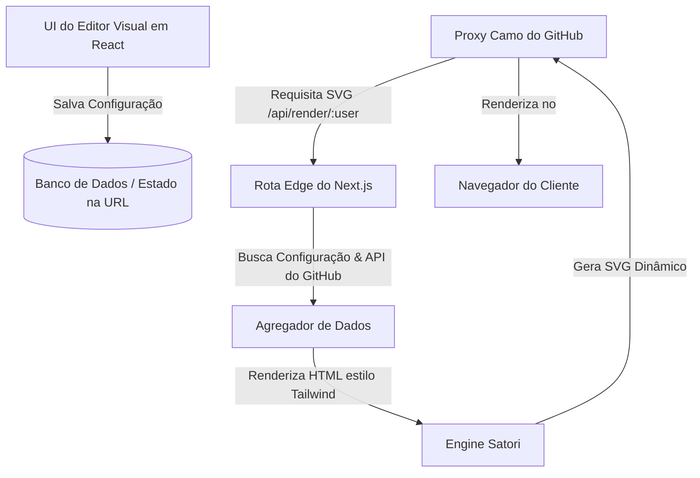

# GitAscii: Um Editor Visual para READMEs de Perfil do GitHub

Seu perfil do GitHub é seu cartão de visitas digital na comunidade open-source. No entanto, manter um README de perfil que seja visualmente atraente, informativo e atualizado dinamicamente costuma se tornar uma tarefa manual e cansativa. Os desenvolvedores são frequentemente forçados a escolher entre editar arquivos Markdown manualmente, depender de vários geradores de estatísticas de terceiros desalinhados ou lidar com layouts quebrados em dispositivos móveis.

O **GitAscii** resolve esse problema ao introduzir um espaço de trabalho visual unificado com sistema de arrastar e soltar. Em vez de escrever tabelas HTML complexas ou configurar múltiplos repositórios externos, você constrói seu perfil visualmente. O editor gera um esquema de configuração, que é compilado sob demanda em um único SVG altamente otimizado e responsivo ao tema do sistema.

---

## O Problema Central: Por que READMEs de Perfil são Frágeis

Construir um README de perfil personalizado apresenta vários desafios técnicos:

1. **Proxy Camo do GitHub**: O GitHub roteia todas as imagens de READMEs por meio do `camo.githubusercontent.com` para evitar avisos de conteúdo misto e rastreamento de IPs de usuários. Esse proxy faz um cache agressivo de imagens, o que significa que qualquer estatística dinâmica precisa declarar políticas de cache estritas, sob o risco de exibir dados obsoletos.
2. **Alinhamento Responsivo**: O Markdown não suporta nativamente layouts de grade (grid) ou estilização flexbox avançada. Criar um layout de várias colunas com badges de status, estatísticas de código e seções de biografia requer escrever estruturas brutas em HTML com `<table>` ou `<div>` que frequentemente quebram em telas estreitas.
3. **Sincronização de Temas**: O GitHub suporta temas claros e escuros. A maioria dos geradores de badges externos retorna imagens estáticas com cores de fundo fixas, tornando-as ilegíveis quando um usuário altera o tema da interface do GitHub.
4. **Custo de Manutenção**: Manter métricas atualizadas (como posts recentes do blog, estrelas atuais em repositórios ou o status de reprodução do Spotify) exige tarefas cron em segundo plano ou GitHub Actions que realizam commits no repositório do seu perfil, poluindo o histórico do Git.

---

## A Arquitetura do GitAscii

O GitAscii combina uma engine de layout baseada no navegador com uma pipeline de renderização hospedada na Edge para contornar essas limitações.



### 1. O Editor Visual (Client-Side)

Construído com **Next.js**, **React** e **Tailwind CSS**, o editor permite organizar elementos de layout (widgets) em uma grade flexível. O layout é salvo como um esquema JSON, que define posições, dimensões, tipos de widgets e configurações personalizadas do usuário.

### 2. Renderização na Edge e Pipeline de Cache

Em vez de renderizar o HTML no navegador do cliente e fazer com que o usuário baixe centenas de kilobytes de JavaScript, o GitAscii serve uma única URL do tipo ``. Quando o proxy Camo do GitHub solicita essa URL, nosso handler na Edge busca o esquema de layout do usuário, agrega dados em tempo real da API do GitHub e compila os componentes usando o [Satori](https://github.com/vercel/satori). O Satori converte elementos HTML/CSS estilizados com classes inline do Tailwind em caminhos SVG limpos e padronizados.

### 3. Caching Dinâmico & Mitigação de Latência do Camo

Para equilibrar tempos de carregamento rápidos com dados atualizados, o GitAscii utiliza uma estratégia personalizada de invalidação de cache. Aproveitamos o cabeçalho HTTP `Cache-Control` para gerenciar como o proxy Camo do GitHub e o navegador do usuário manipulam o recurso:

```http
Cache-Control: public, max-age=0, s-maxage=300, stale-while-revalidate=600
```

- **`max-age=0`**: Instrui o navegador do usuário final a não armazenar a imagem no cache local, garantindo que o retorno à página force uma nova requisição.
- **`s-maxage=300`**: Define que o proxy Camo do GitHub deve manter o SVG em cache por exatamente 5 minutos (300 segundos).
- **`stale-while-revalidate=600`**: Permite que o proxy Camo sirva o SVG antigo (stale) imediatamente enquanto busca a versão atualizada em segundo plano, reduzindo a latência do TTFB (Time to First Byte) para o visitante.

---

## Mergulho Técnico: Conversão de Arte ASCII no Navegador

Um dos recursos exclusivos do GitAscii é o conversor de arte ASCII integrado diretamente no client-side. Os usuários podem carregar uma imagem e o GitAscii a transforma em uma representação de texto monocromática ou colorida, imitando uma saída de terminal.

Para realizar esse processo sem sobrecarregar o servidor com processamento de imagem, realizamos manipulações no elemento canvas diretamente no navegador, conforme o algoritmo a seguir:

```typescript
/**
 * Converte um arquivo de imagem de origem em uma string ASCII baseada na luminância dos pixels.
 *
 * @param imageEl - O elemento HTMLImageElement carregado.
 * @param cols - Número de colunas na arte ASCII final (controla a resolução horizontal).
 * @param rows - Número de linhas na arte ASCII final (controla a resolução vertical).
 * @returns A string de texto ASCII gerada.
 */
export function convertImageToAscii(imageEl: HTMLImageElement, cols: number, rows: number): string {
  const canvas = document.createElement('canvas')
  const ctx = canvas.getContext('2d')
  if (!ctx) return ''

  // Define dimensões visuais para corresponder à resolução desejada
  canvas.width = cols
  canvas.height = rows

  // Desenha a imagem reduzida para cols * rows
  ctx.drawImage(imageEl, 0, 0, cols, rows)

  // Obtém os dados brutos de pixel em formato RGBA
  const imgData = ctx.getImageData(0, 0, cols, rows)
  const data = imgData.data

  // Rampa de caracteres ASCII ordenada do mais denso (escuro) ao mais esparso (claro)
  const charRamp = '@#S%?*+;:+,. '
  const rampLength = charRamp.length
  let asciiResult = ''

  for (let y = 0; y < rows; y++) {
    for (let x = 0; x < cols; x++) {
      const idx = (y * cols + x) * 4
      const r = data[idx]
      const g = data[idx + 1]
      const b = data[idx + 2]
      const a = data[idx + 3]

      // Se o pixel for totalmente transparente, trata como espaço vazio
      if (a < 10) {
        asciiResult += ' '
        continue
      }

      // Calcula a luminância relativa usando pesos padrão Rec. 709
      const luminance = 0.2126 * r + 0.7152 * g + 0.0722 * b

      // Mapeia a luminância (0-255) para um caractere correspondente na rampa
      const charIndex = Math.floor((luminance / 255) * (rampLength - 1))
      asciiResult += charRamp[charIndex]
    }
    // Adiciona quebra de linha ao final de cada linha horizontal
    asciiResult += '\n'
  }

  return asciiResult
}
```

> [!NOTE]
> Como os caracteres de texto padrão são mais altos do que largos, recomendamos corrigir a proporção da imagem reduzindo o número de linhas horizontais (`rows`) em relação às colunas (`cols`) por um fator aproximado de `0.55` antes da renderização final para evitar que a arte ASCII pareça esticada verticalmente.

---

## Responsividade de Tema em SVGs Dinâmicos

Para se adaptar nativamente aos temas claro e escuro do GitHub, o GitAscii injeta um bloco de estilos CSS dinâmico dentro do próprio arquivo SVG. Utilizando as media queries padrão do sistema operacional diretamente na definição do SVG, conseguimos mapear as variáveis do tema do GitHub:

```xml
<svg xmlns="http://www.w3.org/2000/svg" viewBox="0 0 800 400" width="100%" height="100%">
  <style>
    /* Valores padrão para tema escuro */
    .bg { fill: #0d1117; }
    .text-primary { fill: #c9d1d9; font-family: 'Fira Code', monospace; }
    .text-accent { fill: #58a6ff; font-weight: bold; }

    /* Regras de sobrescrita quando o tema claro é preferido */
    @media (prefers-color-scheme: light) {
      .bg { fill: #ffffff; }
      .text-primary { fill: #24292f; }
      .text-accent { fill: #0969da; }
    }
  </style>

  <!-- Camada de Fundo -->
  <rect class="bg" width="100%" height="100%" rx="8" />

  <!-- Conteúdo Dinâmico -->
  <text x="40" y="60" class="text-accent" font-size="24">Dashboard GitAscii</text>
  <text x="40" y="100" class="text-primary" font-size="16">> Inicializando widgets...</text>
</svg>
```

Quando o contêiner do GitHub processa esse SVG (seja de forma inline ou por meio de uma tag ``), o navegador do visitante interpreta a query `@media` e altera as cores dinamicamente, sem precisar realizar uma nova requisição HTTP para o servidor.

---

## Contribua com o Projeto

O GitAscii é totalmente de código aberto e foi desenvolvido para criadores que desejam total controle sobre seus perfis sem precisar lidar com milhares de linhas de tabelas HTML manuais.

> [!TIP]
> Você mesmo pode hospedar o GitAscii! A aplicação está estruturada para rodar facilmente em Vercel Serverless Functions, Netlify ou contêineres Docker padronizados. Consulte as instruções do nosso repositório sobre variáveis de configuração para subir uma instância privada com escopos personalizados de autenticação OAuth do GitHub.

- **Repositório**: [https://github.com/Igorcbraz/GitAscii](https://github.com/Igorcbraz/GitAscii)
- **Editor Visual**: [https://gitascii.com](https://gitascii.com)
