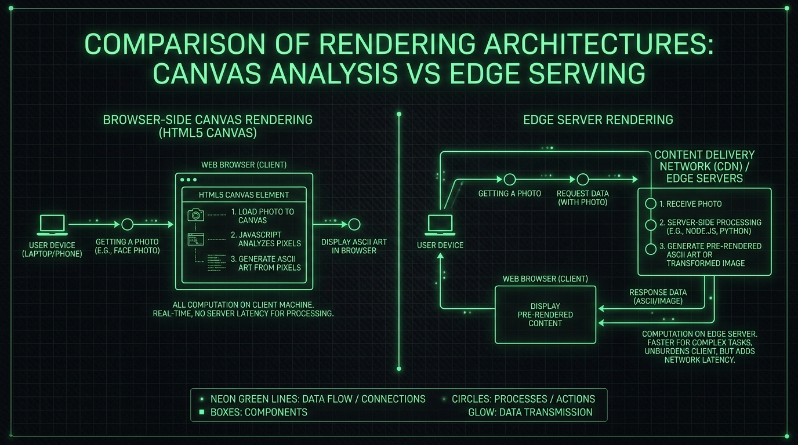

A forma padrão de manter estatísticas atualizadas no README do GitHub sempre envolveu uma GitHub Action rodando em um cron job diário ou de hora em hora. Essa arquitetura resolve o problema de dados desatualizados, mas traz um custo implícito considerável: poluição do histórico de commits do repositório com atualizações automatizadas e o atraso inerente de exibição de dados em lotes (batch).


Ao projetar o **GitAscii** (uma ferramenta de montagem visual de perfis para o GitHub), o maior requisito arquitetural era eliminar por completo os builds assíncronos e periódicos. O desafio técnico passou a ser: como injetar componentes dinâmicos (como grids de commits ou artes ASCII) dentro de uma simples tag de imagem no GitHub e manter isso eficiente?

### O problema estrutural com o GitHub Camo

Qualquer imagem apontada em um arquivo `README.md` no GitHub não é requisitada diretamente pelo navegador do visitante. O GitHub roteia todo tráfego externo de imagens através do Camo, um proxy reverso anonimizador. O Camo foi criado para evitar o vazamento de endereços IP de leitores e impedir ataques de script injetado, mas impõe regras estritas de funcionamento:

1. **Tempo de Resposta Curto**: Se o servidor de origem demorar para responder (timeouts comuns em funções serverless frias), a imagem quebra silenciosamente.
2. **Caches Agressivos**: Se os headers HTTP de controle de cache não forem precisos, a imagem ficará presa em cache (stale) nos servidores do GitHub para sempre, impedindo a exibição de dados em tempo real.
3. **Impossibilidade de Executar Scripts**: O SVG gerado não pode rodar nenhuma linha de JavaScript para buscar dados ou alterar o DOM no lado do cliente.

### Separação Física: Editor (Client) vs. Engine (Edge)

A solução adotada no GitAscii dividiu a aplicação em dois ambientes distintos, baseando-se no ecossistema moderno do Next.js 15 e React 19:



1. **Camada de Edição (Client-side)**: A interface onde o usuário constrói seu layout (estilo Figma). Um ponto crítico de otimização foi a conversão de avatares para arte ASCII. Para evitar processamento pesado e gargalos de CPU no servidor, o cliente utiliza a API nativa de `Canvas` do HTML5, extrai a luminância dos pixels diretamente na thread do navegador do usuário e gera uma matriz de texto imutável que é salva no banco.
2. **Engine de Renderização (Edge)**: O payload salvo no banco é processado por rotas de API rodando em Vercel Edge. Ao invés de usar compilação pesada do React no servidor para cada requisição, as rotas do Next.js Edge acessam a configuração imutável, chamam as APIs do GitHub em paralelo e concatenam strings XML puras para gerar o SVG final de forma ultrarrápida.

### Renderização on-the-fly com Código Real

Abaixo, descrevemos a estrutura conceitual exata de como as rotas de API no Next.js Edge executam essa tarefa em tempo recorde:

```typescript
// app/api/render/[username]/route.ts
import { NextRequest } from 'next/server'

export const runtime = 'edge'

export async function GET(req: NextRequest, { params }: { params: { username: string } }) {
  const username = params.username

  try {
    // 1. Busca paralela de dados: Configuração do layout e Estatísticas Atuais
    const [layoutState, githubStats] = await Promise.all([
      fetchLayoutConfiguration(username),
      fetchGitHubGraphQLStats(username),
    ])

    // 2. Concatenação manual ultrarrápida de strings SVG (evita JSX no Edge)
    const svgMarkup = buildSvgTemplate(layoutState, githubStats)

    return new Response(svgMarkup, {
      status: 200,
      headers: {
        'Content-Type': 'image/svg+xml',
        'Cache-Control': 'public, no-cache, no-store, must-revalidate',
        'CDN-Cache-Control': 'public, s-maxage=3600, stale-while-revalidate=86400',
      },
    })
  } catch (error) {
    return new Response('<svg>...</svg>', { status: 500 })
  }
}
```

### O pulo do gato nos Headers de Cache

A configuração de cache é o segredo para fazer o GitHub Camo cooperar. O header `'CDN-Cache-Control'` instrui a rede de entrega de conteúdo (CDN) a armazenar a resposta em cache por uma hora (`s-maxage=3600`), permitindo que a imagem seja servida instantaneamente aos próximos leitores. A diretiva `stale-while-revalidate=86400` garante que, caso o cache expire, a CDN sirva a versão antiga em milissegundos enquanto atualiza o SVG em segundo plano.

Para resolver a questão dos temas Claro e Escuro sem JavaScript, o markup SVG incorpora media queries CSS (`@media (prefers-color-scheme: dark)`) diretamente em seu código interno. O proxy do GitHub simplesmente repassa o SVG intacto para o navegador do leitor, que se encarrega de renderizar os estilos corretos de cor automaticamente.

### Conclusão

Essa arquitetura serverless no Edge prova que é possível ter perfis e dashboards altamente dinâmicos sem a necessidade de manter servidores dedicados ligados 24 horas por dia ou criar pipelines de CI/CD que geram commits indesejados. O processamento pesado no cliente e a montagem rápida no Edge tornam a web mais leve, responsiva e barata de se manter.
