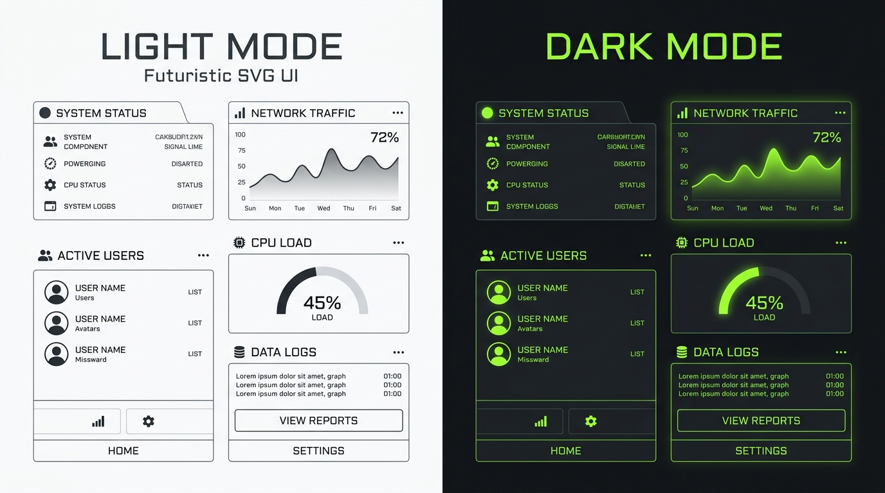

A limitação mais frustrante do proxy Camo do GitHub não é o cache estrito de imagens, mas a esterilização absoluta de qualquer script no lado do cliente. Isso cria um problema arquitetural bizarro: como entregar um banner ou gráfico no `README.md` que responda automaticamente ao tema claro ou escuro do sistema operacional do leitor, se você não tem acesso ao DOM para detectar o estado atual da UI e injetar classes CSS com JavaScript?



Muitas ferramentas tentam resolver isso passando o tema via query string (ex: `?theme=dark`). O problema óbvio é que isso requer a intervenção manual do desenvolvedor que está instalando o badge, e a imagem quebra visualmente assim que o leitor inverte o tema do seu próprio sistema operacional ou navegador.

### A técnica CSS-in-SVG

No desenvolvimento do **GitAscii** (uma plataforma de design de perfis visuais), precisávamos que os layouts complexos de terminal se adaptassem ao fundo do GitHub do leitor com perfeição.

A solução elegante foi explorar a natureza XML estruturada do formato SVG. Como o SVG é renderizado pelo navegador como um documento independente (standalone), as regras CSS nativas declaradas dentro dele continuam válidas e são interpretadas na máquina do usuário final, mesmo quando o arquivo é servido por uma URL proxyada pelo Camo.

Podemos embarcar a media query `@media (prefers-color-scheme)` diretamente dentro de tags `<style>` no payload do SVG gerado no Edge:

```xml
<svg xmlns="http://www.w3.org/2000/svg" width="800" height="200" viewBox="0 0 800 200">
  <style>
    /* Estilos padrão (Light Mode) */
    .background {
      fill: #ffffff;
      transition: fill 0.3s ease;
    }
    .text-primary {
      fill: #1a1a1a;
      font-family: 'Courier New', Courier, monospace;
      font-size: 16px;
    }
    .accent {
      fill: #2ea44f;
    }

    /* Sobrescrita automática via Media Query no navegador do leitor (Dark Mode) */
    @media (prefers-color-scheme: dark) {
      .background {
        fill: #0d1117; /* Cor de fundo padrão do GitHub */
      }
      .text-primary {
        fill: #c9d1d9; /* Cor de texto padrão do GitHub */
      }
      .accent {
        fill: #c5ff4a; /* Verde limão característico do GitAscii */
      }
    }
  </style>

  <!-- Elementos do SVG associados às classes -->
  <rect class="background" width="100%" height="100%" rx="8" />
  <text class="text-primary" x="20" y="50">GitAscii Terminal Engine v1.2</text>
  <rect class="accent" x="20" y="80" width="150" height="4" />
</svg>
```

### O papel do proxy Camo neste cenário

É crucial entender por que essa abordagem contorna as limitações de segurança do GitHub. Quando o Camo busca o SVG do nosso servidor Edge:

1. Ele armazena o XML puro no cache da CDN do GitHub.
2. Ele reescreve a URL no README para apontar para `https://camo.githubusercontent.com/xyz/image.svg`.
3. Quando o navegador de um leitor carrega o README, ele faz o download do arquivo XML do SVG através da CDN do GitHub.
4. O navegador analisa o XML do SVG localmente. Ao encontrar a tag `<style>`, ele a processa exatamente como faria com um arquivo HTML local.
5. A media query `prefers-color-scheme` detecta as preferências de tema do sistema do leitor e renderiza as cores corretas em tempo de tela.

Dessa forma, o servidor devolve um único asset estático, mas que carrega sua própria lógica de renderização responsiva delegada ao cliente.

### Conclusão

Essa técnica demonstra como padrões abertos da web (como a especificação XML do SVG e Media Queries de CSS) podem contornar barreiras de segurança e de cache sem comprometer a integridade do sistema ou o desempenho de entrega do servidor. Ao projetar soluções edge-first, entender o comportamento do navegador do cliente final é tão importante quanto escrever código de backend eficiente.
