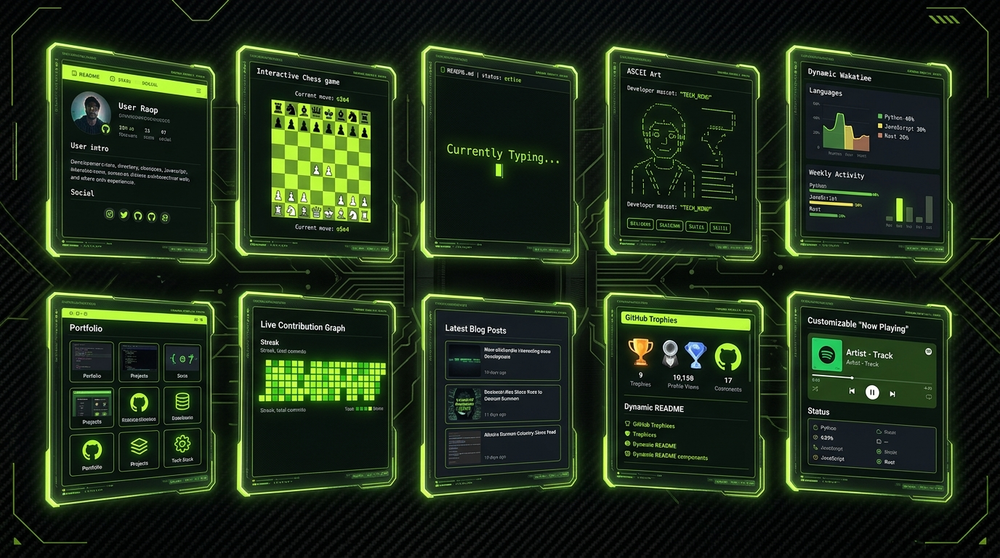

A recruiter or an open-source maintainer spends an average of 6 seconds looking at your GitHub profile before deciding to click away. Seeing a wall of unformatted text is the fastest way to lose their attention.



Here are 10 tricks to grab their attention instantly and make your profile look like a senior engineer's portfolio.

---

### 1. Leverage Dynamic Typing SVGs

Tools like `readme-typing-svg` add a nice typewriter effect to your headline, giving the profile a dynamic feel immediately.

```markdown
[](https://git.io/typing-svg)
```

---

### 2. Ditch Standard Markdown for GitAscii

Stop writing nested markdown tables to align images. Use **GitAscii**, a drag-and-drop visual builder that lets you compose terminal-like widgets, statistics, and pixel-perfect ASCII art into a single cohesive layout.

It outputs a single dynamic URL that you embed, rendering an auto-updating SVG via Edge. It's essentially Figma for your README.

```markdown
[](https://gitascii.com/edit/yourusername)
```

---

### 3. WakaTime Coding Metrics

Integrate your IDE activity directly into your profile to show what languages you actually spend time writing rather than just counting commits.

```markdown

```

---

### 4. Interactive Chess Games

You can embed an interactive, issue-driven chess board where the community plays against each other by opening issues to submit moves. The readme automatically updates its SVG to show the updated board layout.

---

### 5. Automated Blog Post Feeds

Use GitHub Actions (or tools like DevPublisher) to automatically fetch your latest Dev.to, Medium, or Hashnode articles and inject them into your README.

```yaml
# .github/workflows/blog-posts.yml
name: Update Blog Posts
on:
  schedule:
    - cron: '0 * * * *'
jobs:
  update-readme:
    runs-on: ubuntu-latest
    steps:
      - uses: actions/checkout@v3
      - uses: gautamkrishnar/blog-post-workflow@master
        with:
          feed_list: 'https://dev.to/feed/yourusername'
```

---

### 6. Use HTML Details Tags for Accordions

Keep your profile clean by hiding secondary information, like detailed course certifications or setup dotfiles, inside collapsible accordions.

```markdown
<details>
  <summary>🛠️ View My Development Stack</summary>

- OS: Arch Linux / macOS Sonoma
- Editor: Neovim (lazy.nvim)
- Shell: Zsh + Oh My Zsh

</details>
```

---

### 7. Dynamically Updated Spotify Widget

Show what you are listening to right now on Spotify. By creating a Vercel serverless function connected to Spotify's API, you can serve an SVG containing the song title, artist, and live progress bar.

---

### 8. Add GitHub Profile Trophy Cards

Display your GitHub achievements as retro game trophies. It gamifies your open-source contributions and adds visual variety to your stats area.

```markdown
[](https://github.com/ryo-ma/github-profile-trophy)
```

---

### 9. Adapt SVG Assets to Light and Dark Modes

To prevent your custom diagrams from looking unreadable in dark mode or washed out in light mode, embed media queries inside your custom SVGs. You can change background fills and text strokes dynamically using `prefers-color-scheme`.

---

### 10. Center Your Assets with HTML Divs

Markdown does not natively support center alignment, but HTML does. Wrap your key introductory badges and graphics in centered `div` containers to make your presentation look clean on both wide desktop screens and mobile viewports.

```html
<div align="center">
  
</div>
```

---

### Conclusion

Your GitHub profile README is the landing page of your professional software engineering career. By combining interactive widgets, automated blog feeds, and clean layouts from tools like GitAscii, you create a memorable visual experience that stands out to recruiters and maintainers alike.
