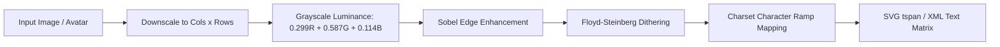

# ASCII Conversion Pipeline

GitAscii includes dedicated ASCII sub-engines for both image-to-text rasterization (`src/engine/ascii/converter.ts`) and string-to-FIGlet banner generation (`src/engine/ascii/textConverter.ts`).

## Image to ASCII Conversion

```typescript
import {
  convertImageToAsciiCanvas,
  generateAsciiArt,
  CHARSETS,
  AsciiConvertOptions,
} from '@/engine/ascii/converter'
```

### Conversion Pipeline Steps



### Character Set Catalog

```typescript
export const CHARSETS = {
  dense: "$@B%8&WM#*oahkbdpqwmZO0QLCJUYXzcvunxrjft/\\|()1{}[]?-_+~<>i!lI;:,\"^`'. ",
  standard: '@%#*+=-:. ',
  blocks: '█▓▒░ ',
  dots: '⣿⣇⡇⠇⠃⠁ ',
  matrix: '0123456789ABCDEF ',
  ascii: " .',:;!|/>(){}[]?-_+~<>i!lI;:",
  binary: '01 ',
  slash: '/\\| ',
  retro: '.oO@Oop ',
  minimal: '.*# ',
  braille: '⡿⣟⣯⣷ ',
}
```

---

## Text to ASCII Art Conversion

The `convertTextToAscii` function translates alphanumeric strings into FIGlet-style ASCII art lines using embedded bitmap matrices:

```typescript
import { convertTextToAscii } from '@/engine/ascii/textConverter'

const asciiLines = convertTextToAscii('GITASCII', {
  font: 'slant', // 'block' | 'slant' | 'thin'
  charSpacing: 1,
  charset: 'default',
})

console.log(asciiLines.join('\n'))
```
