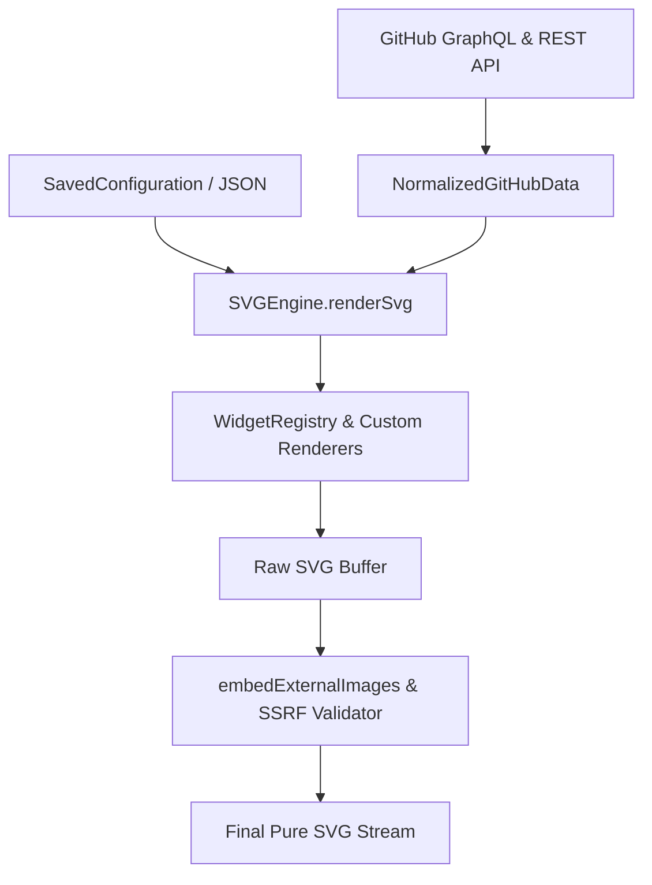

# Welcome to GitAscii API

**GitAscii** is an open-source, serverless SVG rendering engine and visual editor that generates aesthetic, real-time dynamic profile cards and banners for GitHub READMEs.

Developers can design their profiles interactively in the web editor at [gitascii.com](https://gitascii.com) or use the underlying **TypeScript Engine & API** to construct, configure, and render widgets and full-page compositions programmatically.

```
GitAscii Editor
      ↓
Widget Configuration
      ↓
JSON Schema (SavedConfiguration)
      ↓
API / Core SVGEngine
      ↓
Widget Registry & Renderers
      ↓
Sanitized, Inlined SVG Output
```

<CardGroup cols={2}>
  <Card title="Quickstart" icon="bolt" href="/quickstart">
    Learn how to render your first widget SVG in seconds.
  </Card>
  <Card title="API Overview" icon="code" href="/api/overview">
    Explore the programmatic SVGEngine, routes, and data pipelines.
  </Card>
  <Card title="Widget Catalog" icon="grid-2" href="/widgets/overview">
    Discover all 40+ widgets across Native, ASCII, GodProfile, and ControlPlane suites.
  </Card>
  <Card title="JSON Schema" icon="brackets-curly" href="/api/json">
    Understand the configuration format exported and consumed by the engine.
  </Card>
</CardGroup>

## Core Principles

<ResponseField name="Accuracy" type="Architecture">
  Every parameter documented here maps 1:1 to production code in `src/engine/` and
  `src/features/widgets/`.
</ResponseField>

<ResponseField name="Universal Rendering" type="Engine">
  Widgets can be rendered as isolated standalone SVGs or combined into stacked, absolute-positioned
  compositions.
</ResponseField>

<ResponseField name="Zero Runtime Dependency" type="SVG Output">
  Generated SVGs contain inlined Google Fonts, CSS animations (or SMIL fallbacks), and embedded
  image buffers ready for GitHub Camo Proxy.
</ResponseField>

## Architecture Pipeline



1. **Normalized GitHub Data**: Fetches user repos, commits, stargazers, forks, languages, and contribution heatmaps into a strictly typed `NormalizedGitHubData` model.
2. **SavedConfiguration Schema**: Defines the global styles, template theme, and array of positioned `WidgetInstance` elements.
3. **Core SVG Engine**: Computes bounding boxes, calculates grid coordinates, applies entrance animation keyframes, and invokes the registry map.
4. **External Asset Inliner**: Resolves and embeds third-party badges, avatar binaries, and shields into base64 data URIs or inlined `<svg>` trees to ensure fast cache hits through GitHub's Camo CDN proxy.
