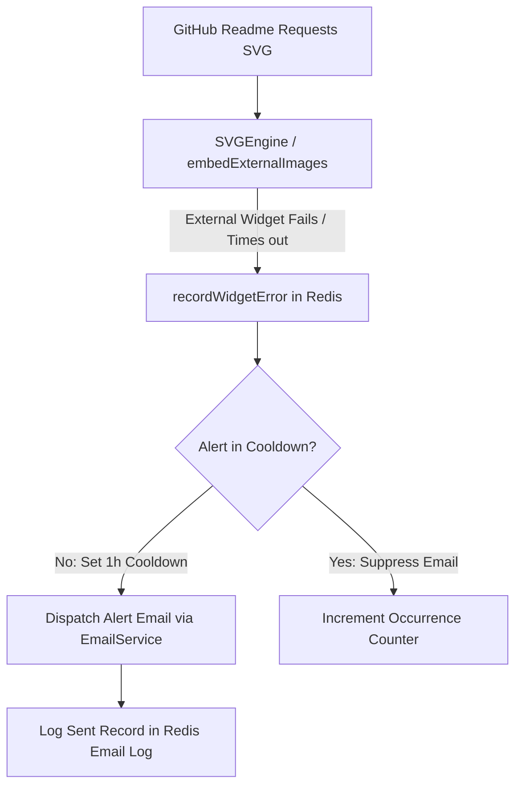

# GitAscii Pro — Architecture, Redis Persistence & Telemetry

This document outlines the architecture, data models, privacy design, and telemetry pipeline for **GitAscii Pro**.

---

## 1. Overview & Principles

- **Single Persistence Layer**: Uses **Upstash Redis** exclusively. No PostgreSQL, MongoDB, Supabase, or additional relational/document databases are introduced.
- **Integrated Architecture**: Runs natively inside the existing Next.js App Router without introducing a separate API service.
- **Privacy by Design (LGPD / GDPR Compliant)**:
  - Zero raw IP address storage.
  - Daily rotating salt for visitor anonymization (`HMAC-SHA256(ip + ua, salt)`).
  - HyperLogLog (`PFADD` / `PFCOUNT`) for $O(1)$ unique visitor tracking.
  - Zero cross-site tracking, zero personal profiling.
- **Future-Ready Subscription Model**: Architecture includes entitlement abstraction (`getProEntitlements`), preparing for Stripe subscriptions, plan quotas, and custom domains without hardcoded billing lock-in.

---

## 2. Routes & Navigation Structure

### App Router Frontend Routes (`/pro`)

| Route            | View                          | Description                                                                                                   |
| ---------------- | ----------------------------- | ------------------------------------------------------------------------------------------------------------- |
| `/pro`           | `OverviewDashboard`           | High-level summary of views, uniques, active profiles, error alerts, recent events, and traffic chart.        |
| `/pro/analytics` | `AnalyticsDashboard`          | In-depth metrics, time range filters (24h, 7d, 30d, 90d, all), hourly distribution, and dimension breakdowns. |
| `/pro/reports`   | `ReportsDashboard`            | Consolidated executive reports, exportable summaries, and profiles breakdown.                                 |
| `/pro/errors`    | `WidgetErrorsDashboard`       | Real-time tracking of failed GitHub README widgets, technical diagnostics, and resolve actions.               |
| `/pro/emails`    | `EmailNotificationsDashboard` | Dispatched notification audit log, delivery status, and trigger explanations.                                 |
| `/pro/profiles`  | `ProfilesDashboard`           | Multi-profile management (create, configure, delete, and copy markdown embed URLs).                           |

### Server API Endpoints (`/api/pro`)

| Method            | Endpoint                    | Description                                                                                     |
| ----------------- | --------------------------- | ----------------------------------------------------------------------------------------------- |
| `GET`             | `/api/pro/overview`         | Retrieves consolidated metrics, top profiles, error counts, and recent activity.                |
| `GET`             | `/api/pro/analytics`        | Retrieves time-series, uniques, hourly histograms, and dimension rankings (`range`, `profile`). |
| `GET`             | `/api/pro/reports`          | Generates structured performance report for export or printing.                                 |
| `GET`, `POST`     | `/api/pro/errors`           | Lists logged widget failures or simulates test error events.                                    |
| `PATCH`           | `/api/pro/errors/[errorId]` | Marks an active widget error as resolved.                                                       |
| `GET`, `POST`     | `/api/pro/emails`           | Lists dispatched email logs or triggers test email alerts.                                      |
| `GET`, `POST`     | `/api/pro/profiles`         | Lists user profiles or creates a new profile (validating plan limits).                          |
| `PATCH`, `DELETE` | `/api/pro/profiles/[slug]`  | Updates profile metadata or deletes a custom profile.                                           |

---

## 3. Redis Key Schema & TTL Retention Strategy

All keys are namespaced under `gitascii:pro:` and strictly isolated by username.

### Key Schema

```
# Multi-Profile Management
gitascii:pro:{username}:profiles                 -> Set [ "default", "minimal", "stats" ]
gitascii:pro:{username}:profile:{slug}           -> Hash { id, name, description, status, isDefault, widgetsCount, totalViews, createdAt, updatedAt }

# User Settings & Entitlements
gitascii:pro:{username}:settings                 -> Hash { emailAlertsEnabled, alertEmailAddress, dailyDigestEnabled, themePreference }
gitascii:pro:{username}:totals                   -> Hash { totalViews, totalErrors }

# Time-Series Analytics (Daily, 90-Day TTL)
gitascii:pro:{username}:{slug}:daily:{YYYY-MM-DD}        -> Hash { views, cacheHits, camoViews }
gitascii:pro:{username}:{slug}:hll:{YYYY-MM-DD}          -> HyperLogLog (unique visitor tokens)
gitascii:pro:{username}:{slug}:hourly:{YYYY-MM-DD}       -> Hash { "0": 5, "1": 2, ..., "23": 18 }

# Audience Dimensions (Daily, 90-Day TTL)
gitascii:pro:{username}:{slug}:dim:countries:{YYYY-MM-DD} -> Hash { "US": 120, "BR": 85, "DE": 40 }
gitascii:pro:{username}:{slug}:dim:sources:{YYYY-MM-DD}   -> Hash { "GitHub": 210, "Google Search": 15 }
gitascii:pro:{username}:{slug}:dim:devices:{YYYY-MM-DD}   -> Hash { "Desktop": 180, "Mobile": 45, "GitHub Camo": 90 }
gitascii:pro:{username}:{slug}:dim:browsers:{YYYY-MM-DD}  -> Hash { "Chrome": 150, "Safari": 70, "Firefox": 25 }
gitascii:pro:{username}:{slug}:dim:os:{YYYY-MM-DD}        -> Hash { "macOS": 130, "Windows": 90, "Linux": 40 }

# Widget Errors Tracker (90-Day Retention)
gitascii:pro:{username}:errors:list              -> Sorted Set (score = timestamp, member = errorId)
gitascii:pro:{username}:errors:{errorId}         -> Hash { id, widgetId, widgetName, profileSlug, errorType, message, details, status, occurrences, firstSeenAt, lastSeenAt, resolvedAt }
gitascii:pro:{username}:cooldown:alert:{widgetId}-> String (1-hour TTL for spam prevention)

# Sent Email Notifications History (90-Day Retention)
gitascii:pro:{username}:emails:list              -> Sorted Set (score = timestamp, member = emailId)
gitascii:pro:{username}:emails:{emailId}         -> Hash { id, recipientEmail, templateName, subject, reason, relatedWidget, relatedProfile, sentAt, status, messageId }
```

### TTL & Eviction Strategy

| Data Category         | Structure         | Retention / TTL | Cost & Memory Optimization                        |
| --------------------- | ----------------- | --------------- | ------------------------------------------------- |
| Daily Traffic Rollups | Hash              | 90 days         | Automatic expiry prevents stale accumulation.     |
| Unique Visitors       | HyperLogLog       | 90 days         | $O(1)$ constant memory (~12KB max per key).       |
| Dimensions            | Hash              | 90 days         | Top aggregates merged across time ranges on read. |
| Widget Error History  | Sorted Set + Hash | 90 days         | Capped at latest 50 items per user.               |
| Email Logs            | Sorted Set + Hash | 90 days         | Capped at latest 50 items per user.               |
| Error Alert Cooldown  | String            | 1 hour          | Prevents duplicate alert spam to user inboxes.    |

---

## 4. Privacy & LGPD Architecture

1. **Zero Raw IP Storage**: IPs from `x-forwarded-for` or `cf-connecting-ip` are strictly processed in-memory to generate an ephemeral daily hash:
   $$\text{VisitorToken} = \text{HMAC-SHA256}(\text{IP} \parallel \text{UserAgent}, \text{DailySalt})[0:16]$$
   The `DailySalt` changes every 24 hours UTC, rendering cross-day and cross-service tracking mathematically impossible.
2. **Referrer Stripping**: Query parameters, tokens, and tracking IDs are stripped. Only normalized top-level domains are stored.
3. **HyperLogLog Cardinality**: Allows calculating unique visitor counts across arbitrary date ranges (`PFCOUNT key1 key2 ...`) with high accuracy and zero personal data persistence.

---

## 5. Widget Error & Email Notification Pipeline



---

## 6. Future Stripe / Subscriptions Integration Points

- The abstraction `getProEntitlements(username)` in `src/features/pro/server/entitlements.ts` centralizes feature gating:
  - `maxProfiles`: Configurable per plan (Free: 1, Pro: 10, Team: 50).
  - `analyticsRetentionDays`: (Free: 7 days, Pro: 90 days, Enterprise: 365 days).
  - `widgetErrorAlertsEnabled`: Feature flag.
  - `customDomainEnabled`: Feature flag.
- When Stripe webhooks are added in the future, updating the `gitascii:pro:{username}:settings` or user subscription record in Redis will automatically unlock higher tiers without code modifications across UI components.

---

## 7. Environment Variables

| Variable                   | Description                                                          |
| -------------------------- | -------------------------------------------------------------------- |
| `UPSTASH_REDIS_REST_URL`   | Upstash Redis REST URL.                                              |
| `UPSTASH_REDIS_REST_TOKEN` | Upstash Redis REST authentication token.                             |
| `SESSION_SECRET`           | 32+ character key for session cookie encryption and HMAC daily salt. |
| `RESEND_API_KEY`           | Resend API key for automated email delivery.                         |
| `NEXT_PUBLIC_APP_URL`      | Application root URL (e.g. `https://gitascii.com`).                  |
