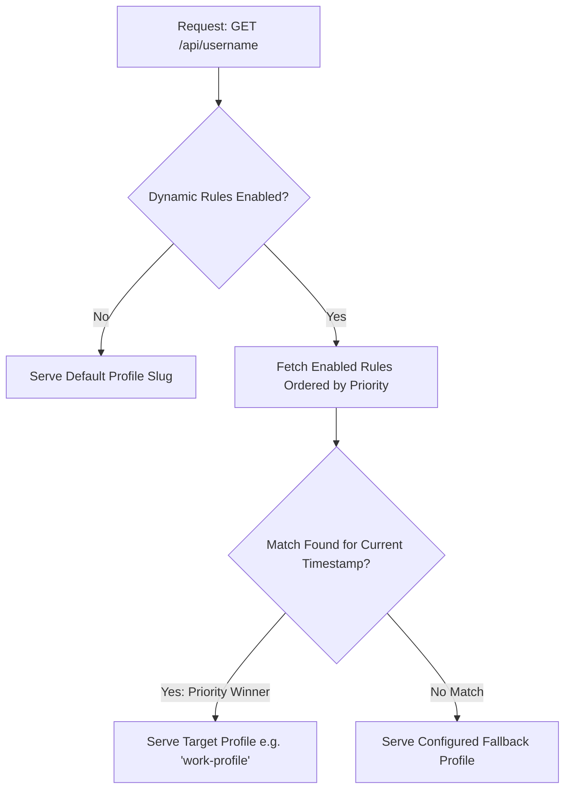

# Dynamic Rules & Scheduling

With **Dynamic Rules**, GitAscii Pro automatically switches which profile configuration is rendered when someone loads your root embed endpoint (`https://gitascii.com/api/username`).

Show a clean, professional corporate dashboard during business hours, switch to a fun creative gaming ASCII showcase on evenings/weekends, or feature special event themes during hackathons and conferences.

---

## 1. Rule Types & Supported Triggers

| Rule Type | Trigger Condition | Example Use Case |
| :--- | :--- | :--- |
| `work_hours` | Specific time window (e.g. 09:00 - 18:00) on weekdays (Mon-Fri) | Display professional work bio, corporate projects, and LinkedIn links. |
| `weekend` | Saturday & Sunday (00:00 - 23:59) | Display side projects, gaming achievements, and hobby ASCII art. |
| `date_range` | Specific calendar start and end dates | Temporary holiday greetings, summer vacation notices, or milestone celebrations. |
| `event` | Named event schedule with optional expiration timestamp | Feature a live Hackathon leaderboard widget or conference talk banner. |
| `custom` | Granular combination of day-of-week, hour ranges, and timezones | Complex custom recurring schedules. |

---

## 2. Rule Priority & Evaluation Flow

When an HTTP request is made to `https://gitascii.com/api/username`:

- **Priority Ordering**: Rules with higher numerical priority (e.g. `100` vs `10`) are evaluated first.
- **Fallback Profile**: If no rules match the current timestamp, GitAscii seamlessly serves your configured fallback profile without errors.
- **Explicit Slugs**: Requests targeting specific slugs directly (`/api/username/minimal`) bypass dynamic rules and always render the requested slug.

---

## 3. Dynamic Rule Simulator

Before activating rules in production, test them with the interactive **Rule Simulator** located in `/pro/profiles`:

1. Select any simulated date and time.
2. Select any target timezone (e.g. `UTC`, `America/New_York`, `Europe/London`, `Asia/Tokyo`).
3. Click **"Run Simulation"** to see step-by-step evaluation logs:
   - Which rules were checked
   - Which conditions matched or failed
   - Which profile slug was selected as the final output.
