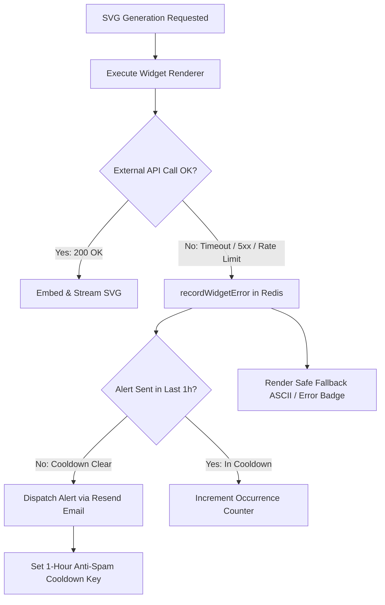

# Widget Error Monitoring & Alerts

GitHub profile READMEs often embed dynamic external widgets — such as WakaTime stats, LeetCode ratings, Spotify banners, or third-party badges. When an external upstream service suffers an outage or API rate-limit, the widget image can fail or display a broken graphic.

**GitAscii Pro** includes an automated **Widget Error Tracker** that detects upstream failures in real time and alerts you before recruiters or colleagues notice broken components on your profile.

---

## 1. How Errors are Trapped and Tracked

During SVG rendering, GitAscii's serverless engine wraps external data fetches and image inlining in monitored execution blocks:

---

## 2. Common Widget Error Types

| Error Type | Meaning | Typical Resolution |
| :--- | :--- | :--- |
| `FETCH_TIMEOUT` | Upstream external API failed to respond within timeout window (default 5000ms). | Check third-party service status or replace with a native GitAscii widget. |
| `RATE_LIMIT_EXCEEDED` | Third-party provider returned HTTP 429 Too Many Requests. | Verify API token quotas or adjust refresh intervals. |
| `UPSTREAM_5XX` | Remote server returned HTTP 500/502/503 error. | Temporary third-party server outage. |
| `INVALID_SVG` | External response was not a valid SVG markup or contained invalid XML entities. | Check external URL payload format. |
| `SSRF_BLOCKED` | Request targeted a private IP address (127.0.0.1, 10.x.x.x, 192.168.x.x). | Prevented by GitAscii's SSRF security layer. |

---

## 3. Redis Persistence & Deduplication

Error records are stored under isolated Redis keys:
- `gitascii:pro:{username}:errors:list`: Sorted set ordered by the most recent error timestamp.
- `gitascii:pro:{username}:errors:{errorId}`: Hash containing diagnostic information:
  - `widgetId` and `widgetName`
  - `profileSlug`
  - `errorType`
  - `message` and `details`
  - `status` (`active` or `resolved`)
  - `occurrences` count
  - `firstSeenAt` and `lastSeenAt`

---

## 4. Email Alert Dispatch & Anti-Spam Cooldown

To prevent overflowing your inbox during upstream microservice flapping or high-traffic periods:
1. When an error occurs, GitAscii checks for an active cooldown key:
   $$\text{Key} = \text{gitascii:pro:}\{username\}\text{:cooldown:alert:}\{widgetId\}$$
2. If the cooldown key does not exist:
   - An alert email is immediately dispatched via **Resend** to your registered GitHub/account email address.
   - The cooldown key is written with a **1-hour TTL** (3600 seconds).
   - An entry is logged in your **Email Logs** (`/pro/emails`).
3. If an error recurs within the 1-hour window, the occurrence counter is incremented in Redis, but duplicate emails are suppressed.

---

## 5. Resolving Errors in the Dashboard

In the `/pro/errors` console:
- View exact HTTP error codes, URLs, and timestamps.
- Simulate test errors to verify your notification pipeline.
- Click **"Mark as Resolved"** to clear the active alert badge from your sidebar once you have fixed or updated the widget configuration.
