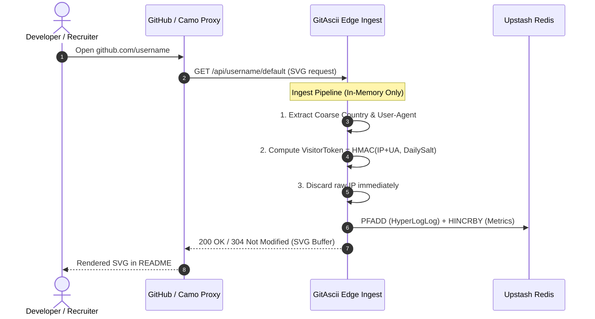

# Telemetry & Privacy Architecture

Developers and visitors value privacy above all else. GitAscii Pro was designed from the ground up on the principle of **Data Minimization and Zero PII Storage**.

Unlike traditional analytics tools that track users across websites using cookies, fingerprinting, or permanent IP tables, GitAscii Pro operates exclusively through **stateless in-memory extraction** and **ephemeral daily rotating salts**.

---

## 1. How GitHub README Requests Work

When a user visits your GitHub profile, their browser loads the README markdown containing your GitAscii SVG image:

```html
<!-- Example Markdown Embed -->

```

GitHub may serve this image either directly or through its content proxy, **GitHub Camo** (`camo.githubusercontent.com`).



---

## 2. Cryptographic Anonymization Pipeline

### The Ephemeral Daily Salt

To count unique visitors without retaining personal identifiers, GitAscii generates a daily cryptographic salt derived from the server's session secret and the current UTC date:

$$\text{DailySalt} = \text{HMAC-SHA256}(\text{ServerSecret}, \text{"salt:"} \parallel \text{YYYY-MM-DD})$$

### The Anonymized Visitor Hash

When an incoming HTTP request hits the API, GitAscii computes a one-way 16-character visitor token:

$$\text{VisitorToken} = \text{HMAC-SHA256}(\text{IP} \parallel \text{UserAgent}, \text{DailySalt})[0:16]$$

> [!IMPORTANT]
> **Why Cross-Day Tracking is Mathematically Impossible**:
> Because the `DailySalt` changes every 24 hours UTC, a visitor who accesses your profile on Monday generates a completely different token on Tuesday. It is mathematically impossible to correlate visits across multiple days or across multiple profile owners.

---

## 3. Unique Visitor Estimation via HyperLogLog ($O(1)$)

To calculate unique visitors over time ranges (e.g. 7 days, 30 days, or 90 days), GitAscii uses Redis **HyperLogLog** registers (`PFADD` / `PFCOUNT`).

### What is HyperLogLog?

HyperLogLog is an advanced probabilistic cardinality estimator:

- **Constant Memory Footprint**: Each HyperLogLog key consumes at most **12 KB of memory**, regardless of whether you have 10 views or 10,000,000 views.
- **High Accuracy**: Provides a standard error rate of $\le 1.04 / \sqrt{m}$ (typically $< 0.81\%$).
- **Arbitrary Date Range Merging**: Multiple daily HyperLogLog keys are combined on-the-fly (`PFCOUNT hll:2026-08-01 hll:2026-08-02 ...`) without retaining individual visitor logs.

---

## 4. Referrer & Metadata Sanitization

Web browsers send a `Referer` header indicating where the image was loaded. To protect visitor privacy while still giving you useful traffic insights:

1. **Query Stripping**: All URL query parameters (`?utm_source=...`, `?token=...`), URL fragments (`#section`), and subpaths are permanently stripped.
2. **Domain Normalization**: Hostnames are categorized into clean, coarse channels:
   - `github.com` $\rightarrow$ **GitHub**
   - `google.*` $\rightarrow$ **Google Search**
   - `x.com`, `twitter.com`, `t.co` $\rightarrow$ **X / Twitter**
   - `linkedin.com` $\rightarrow$ **LinkedIn**
   - `reddit.com` $\rightarrow$ **Reddit**
   - `dev.to`, `hashnode.*` $\rightarrow$ **Dev Community**
   - Direct requests with no referrer $\rightarrow$ **Direct / GitHub README**

---

## 5. GitHub Camo Proxy Detection & Transparency

GitHub routes external README images through an anonymizing proxy called **GitHub Camo** to prevent IP leakage between third-party servers and GitHub users.

GitAscii explicitly detects and tags Camo proxy requests via HTTP headers:

- `via: ... github-camo` or `user-agent: ... github-camo`
- Camo requests are marked in your dashboard as `GitHub Camo Proxy` so you understand why browser/device granularity may be grouped into GitHub's cloud infrastructure.
- Direct visits (e.g., from personal portfolio sites, embeds, or local testing) preserve full browser and OS breakdown.

---

## 6. Privacy & LGPD / GDPR Compliance Matrix

| Guarantee                      | GitAscii Pro Implementation                                               | Legal Standard                 |
| :----------------------------- | :------------------------------------------------------------------------ | :----------------------------- |
| **No Raw IP Storage**          | Raw IP is discarded in-memory immediately after salt hashing.             | LGPD Art. 13 / GDPR Recital 26 |
| **No Third-Party Trackers**    | No Google Analytics, no Facebook Pixels, no client-side tracking cookies. | ePrivacy Directive             |
| **No Persistent Fingerprints** | Rotating 24h salt destroys token continuity across days.                  | GDPR Privacy by Design         |
| **Automated TTL Eviction**     | All Redis keys expire automatically after **90 days**.                    | Data Minimization Principle    |
| **Zero Cross-Site Profiling**  | Data is isolated under `gitascii:pro:{username}:...` namespaces.          | LGPD Art. 6 (Security)         |
