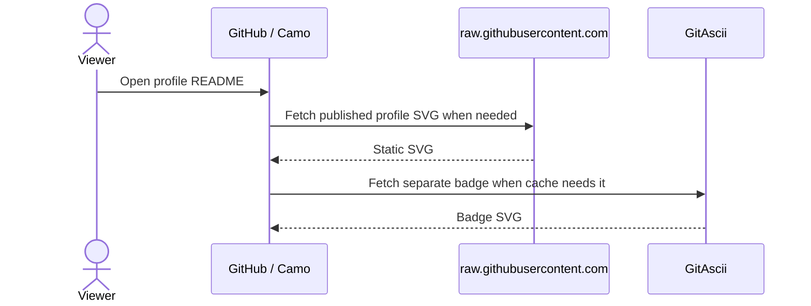

# Telemetry & Privacy

GitAscii v2 serves the usual profile SVG from `raw.githubusercontent.com`, often through GitHub Camo. GitAscii does not receive an HTTP request when that image is loaded, so it cannot count exact profile views or identify individual visitors from the SVG.

Pro can place a **separate badge** below the profile image:

```html

```


```mermaid
sequenceDiagram
  actor Viewer
  participant GitHub as GitHub / Camo
  participant Raw as raw.githubusercontent.com
  participant App as GitAscii
  Viewer->>GitHub: Open profile README
  GitHub->>Raw: Fetch published profile SVG when needed
  Raw-->>GitHub: Static SVG
  GitHub->>App: Fetch separate badge when cache needs it
  App-->>GitHub: Badge SVG
```

## What the dashboard means

A badge request is an observed image fetch, usually from GitHub's image proxy. Caching can combine many README loads into one fetch, and other clients can fetch the badge directly. The dashboard's time series, hourly chart, and profile breakdown describe **badge requests observed by GitAscii**. They are not exact human views, unique visitors, or a census of README impressions.

The badge endpoint records coarse request metadata and counts for Pro accounts. GitHub Camo does not reliably expose the viewer's country, device, browser, operating system, identity, or theme. The v2 dashboard leaves those audience dimensions unavailable instead of inferring them from proxy headers. No raw viewer IP is needed for the v2 badge count.

## Separate publication health signal

For Pro, the repository workflow can send an authenticated OIDC report after rendering. It includes the profile slug, run status, duration, and failed external asset URLs when present. This measures **publication runs and rendering failures**, not README traffic. The health console and health badge use those reports.

The optional HTTP rendering API has its own cache behavior and may be used for previews or Pro dynamic rules. Its requests should not be confused with fetches of the GitHub-hosted v2 SVG. See [Metrics & Charts](/pro/metrics-and-charts) and [Health Monitoring](/pro/health-monitoring).
